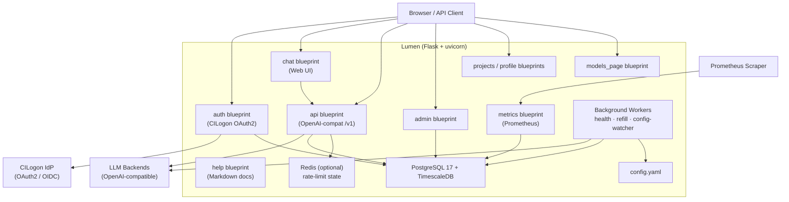

# Lumen Architecture

Lumen is a multi-tenant AI model proxy and management platform. It fronts one or more OpenAI-compatible LLM backends with authentication (CILogon/OAuth2), token-budget enforcement, analytics, and a web chat UI. It is built on Flask 3.x, PostgreSQL 17 + TimescaleDB, and deployed via Docker/uvicorn.

> **Review date:** 2026-05-17 — Senior architect review covering system design, data model, security, scalability, and recommendations.

---

## Table of Contents

1. [System Overview](#system-overview)
2. [Technology Stack](#technology-stack)
3. [Project Layout](#project-layout)
4. [Application Layers](#application-layers)
5. [Blueprints & Routes](#blueprints--routes)
6. [Data Model](#data-model)
7. [Services & Background Workers](#services--background-workers)
8. [Authentication & Access Control](#authentication--access-control)
9. [Token/Coin Economy](#tokencoin-economy)
10. [Configuration Management](#configuration-management)
11. [Observability](#observability)
12. [Deployment](#deployment)
13. [Theme System](#theme-system)
14. [Security Assessment](#security-assessment)
15. [Scalability Assessment](#scalability-assessment)
16. [Technical Debt & Known Issues](#technical-debt--known-issues)
17. [Recommendations](#recommendations)
18. [Key Design Decisions](#key-design-decisions)

---

## System Overview



Lumen sits between clients (browser users and API consumers) and one or more private or third-party LLM backends. It enforces authentication, coin budgets, model access rules, and records every request for audit and analytics. The chat web UI is layered on top of the same `/v1` API that external clients use.

---

## Technology Stack

| Layer | Technology | Notes |
|---|---|---|
| Web framework | Flask 3.0+ | Synchronous WSGI; wrapped in ASGI via a2wsgi |
| ASGI server | Uvicorn 0.30+ | Multi-worker capable; `--workers N` for scale |
| ORM | SQLAlchemy 2.0+ / Flask-SQLAlchemy 3.1+ | 2.x select()-style API throughout |
| Migrations | Alembic via Flask-Migrate 4.0+ | 30+ migrations versioned in `migrations/versions/` |
| Database | PostgreSQL 17 + TimescaleDB 2.26 | TimescaleDB used for `request_logs` hypertable |
| Auth | Authlib 1.3+ · CILogon OAuth2/OIDC | Institutional IdP federation via CILogon |
| LLM client | OpenAI SDK 1.0+ | Used both for proxying and health checks |
| Rate limiting | Flask-Limiter 3.5+ | In-memory (single worker) or Redis (multi-worker) |
| CSRF | Flask-WTF | Exempted on `/v1/*` routes (API clients) |
| Metrics | prometheus-client 0.20+ | Multiprocess mode supported |
| PDF handling | pypdf 4.0+ | File upload support in chat |
| Templating | Jinja2 with custom `_ThemeLoader` | Theme overlays without forking templates |
| Packaging / runtime | uv / pyproject.toml | Python ≥ 3.11 required |
| Testing | pytest · pytest-flask · Playwright · Locust | Unit, integration, E2E, and load tests |

---

## Project Layout

```
lumen/                   # Main Python package
├── __init__.py          # App factory: create_app()
├── extensions.py        # Flask extension singletons (db, migrate, oauth, limiter, csrf)
├── decorators.py        # @login_required, @api_key_required, @admin_required
├── commands.py          # Flask CLI commands (init_db, reassign_model, sync_*)
├── blueprints/          # One subdirectory per blueprint
│   ├── auth/
│   ├── chat/
│   ├── api/             # OpenAI-compatible /v1 routes
│   ├── admin/
│   ├── projects/
│   ├── profile/
│   ├── models_page/
│   ├── metrics/
│   └── help/
├── models/              # SQLAlchemy ORM (18 models, one file per entity)
├── services/            # Business logic & background workers
│   ├── llm.py           # Proxy logic, access resolution, coin deduction (~520 lines)
│   ├── health.py        # Model endpoint health checker
│   ├── token_refill.py  # Hourly coin replenishment
│   ├── config_watcher.py# Hot-reload watcher (5 s poll)
│   ├── cost.py          # Cost calculation utility
│   └── crypto.py        # HMAC-SHA256 API key hashing
├── templates/           # Jinja2 HTML (base.html + per-blueprint)
└── static/              # CSS, JS, images, vendor (SkipTo.js)

themes/                  # Branding overrides (default, illinois, uic, uis)
migrations/              # Alembic migration scripts (30+)
tests/                   # pytest suite (routes, services, models, accessibility)
loadtesting/             # Locust scripts + dummy backend (port 9999)
docs/                    # Architecture, DB schema, help pages
chart/                   # Kubernetes / Helm chart
asgi.py                  # ASGI entry point (uvicorn target)
run.py                   # Dev server entry point
config.yaml              # Primary runtime configuration
docker-compose.yaml
Dockerfile
```

---

## Application Layers

```
┌──────────────────────────────────────────────────────────┐
│  Presentation   │  blueprints/, templates/, static/      │
├──────────────────────────────────────────────────────────┤
│  Application    │  decorators.py, commands.py            │
│                 │  create_app() wiring in __init__.py    │
├──────────────────────────────────────────────────────────┤
│  Domain/Service │  services/ (llm, health, token_refill, │
│                 │  config_watcher, cost, crypto)          │
├──────────────────────────────────────────────────────────┤
│  Data Access    │  models/ (SQLAlchemy 2.x ORM, 18 models)│
├──────────────────────────────────────────────────────────┤
│  Infrastructure │  PostgreSQL 17 + TimescaleDB, Redis,   │
│                 │  CILogon IdP, LLM backends             │
└──────────────────────────────────────────────────────────┘
```

The app factory (`create_app`) wires all layers together: it initialises extensions, registers blueprints, starts background workers (only in the main worker process to avoid duplicate threads under multi-process uvicorn), and syncs `config.yaml` state into the database on every startup.

---

## Blueprints & Routes

| Blueprint | Mount | Responsibility |
|---|---|---|
| `auth` | `/` | Landing page, OAuth2 login/callback/logout, group auto-assignment |
| `chat` | `/chat` | Web chat UI (SSE streaming) + conversation management |
| `api` | `/v1` | OpenAI-compatible completions, models, and embeddings endpoints |
| `admin` | `/admin` | User/project management, analytics dashboard |
| `projects` | `/projects` | Service account & API key management |
| `profile` | `/profile` | Personal API keys, usage stats |
| `models_page` | `/models` | Model catalog and detail pages with HuggingFace READMEs |
| `metrics` | `/metrics` | Prometheus scrape endpoint (optional Bearer auth) |
| `help` | `/help` | Markdown documentation system with embedded screenshots |

### OpenAI-compatible API (`/v1`)

The `api` blueprint is the core proxy surface:

```
GET  /v1/models                → list active models with health info
GET  /v1/models/<id>           → model detail JSON
POST /v1/chat/completions      → stream/non-stream chat (proxied to backend)
POST /v1/audio/transcriptions  → speech-to-text (billed per hour of audio)
POST /v1/audio/translations    → speech-to-text translated to English
POST /v1/embeddings            → embeddings passthrough
```

Every request through `@api_key_required`:
1. Validates the Bearer token against HMAC-SHA256 hashed API keys in the DB
2. Checks coin budget (`services/llm.py::check_coin_budget`)
3. Enforces rate limits (Flask-Limiter, per authenticated entity)
4. After response: logs to `RequestLog`, deducts coins, updates `ModelStat` and `EntityStat`

The chat blueprint's `/chat/<id>/message` SSE endpoint is functionally a web-UI wrapper around the same proxy logic; it reuses access control and coin deduction from `services/llm.py`.

---

## Data Model

18 SQLAlchemy models organised into five functional areas. See `docs/dbschema.md` for full column-level detail and the ERD.

### Identity & Access

| Model | Purpose |
|---|---|
| `Entity` | Unified table for human users (OAuth) and service projects; `entity_type ∈ {user, project}` |
| `APIKey` | HMAC-SHA256 hashed API keys; tracks per-key request counts, tokens, cost, `last_used_at` |
| `Group` | Named groups with auto-assignment rules evaluated against OAuth claims at login |
| `GroupMember` | Entity ↔ Group many-to-many; supports `config_managed` flag |
| `EntityManager` | User → Project delegation (a user can manage a project's keys) |

### Token Economy

| Model | Purpose |
|---|---|
| `EntityBalance` | Current coin balance per entity; written on every request |
| `EntityLimit` | Per-entity ceiling, refresh rate, starting balance; entity limit overrides group |
| `GroupLimit` | Coin budget inherited by group members; most generous group limit wins |

### Model Access Control

| Model | Purpose |
|---|---|
| `EntityModelAccess` | Per-entity allow/block override for a specific model |
| `GroupModelAccess` | Same, at group level; entity-level takes precedence |
| `EntityModelConsent` | Records user acknowledgment of models with `needs_ack` set |

### LLM Catalogue

| Model | Purpose |
|---|---|
| `ModelConfig` | Logical model (name, cost/token, capabilities, `access`/`needs_ack`/`disabled` flags) |
| `ModelEndpoint` | Physical backend URL + API key; `healthy` flag set by health checker every 60 s |
| `ModelStat` | Per-(entity, model, source) aggregated usage counters; `UNIQUE(entity_id, model_config_id, source)` |
| `EntityStat` | Per-entity aggregated totals across all models; enables O(1) admin list queries |

### Chat & Audit

| Model | Purpose |
|---|---|
| `Conversation` | Chat sessions owned by an entity; soft-deleted via `hidden` flag |
| `Message` | Individual turns with full performance metadata (TTFT, speed, thinking tokens) |
| `RequestLog` | Append-only log of every proxied request; TimescaleDB hypertable partitioned by `time` |

### Entity Relationship (simplified)

```
Entity ──< APIKey
Entity ──< EntityBalance
Entity ──< EntityLimit
Entity ──< EntityModelAccess
Entity ──< EntityModelConsent
Entity ──< EntityStat
Entity ──< GroupMember >── Group ──< GroupLimit
                                   ──< GroupModelAccess
Entity ──< Conversation ──< Message
Entity ──< EntityManager (user → project)
Entity ──< RequestLog (SET NULL on delete)
ModelConfig ──< ModelEndpoint
ModelConfig ──< ModelStat
ModelConfig ──< RequestLog (SET NULL on delete)
```

### Notable schema decisions

- **`RequestLog` FKs use `SET NULL` on delete** — preserves historical data when entities, models, or endpoints are removed. All other FKs cascade.
- **Coin values use `Numeric(12,6)`** — avoids floating-point precision errors for financial accumulation.
- **`entity_stats` uses `entity_id` as PK (no surrogate key)** — there is exactly one row per entity; the FK doubles as the PK, which also prevents accidental duplicates.
- **`model_endpoints.model_name` overrides the logical name** — allows one Lumen model to map to differently-named upstream models across endpoints.

---

## Services & Background Workers

### `services/llm.py` (~520 lines)

Core proxy logic. Key functions:

| Function | Purpose |
|---|---|
| `get_next_endpoint(model)` | Round-robin load balancing across healthy endpoints only |
| `bulk_model_access_info(entity, models)` | Batch-resolve access + consent for many models in O(n) DB queries |
| `get_model_access_status(entity, model)` | Access resolution: entity rule → group rule → model access → group/entity/global defaults |
| `check_coin_budget(entity)` | Validate balance > 0 before forwarding; respects unlimited (-2) and blocked (0) sentinels |
| `subtract_coins(entity, cost)` | Decrement `EntityBalance.coins_left`; uses `SELECT ... FOR UPDATE` |
| `send_message_stream()` | Wraps OpenAI SDK streaming as SSE; accumulates token counts for post-request accounting |
| `update_stats()` | Increment `ModelStat`, `EntityStat`, `APIKey` counters; insert `RequestLog` row |

### Background Workers

All three workers are daemon threads started inside `create_app`. A `SERVER_IS_MAIN_WORKER` flag prevents duplicate threads when uvicorn runs multiple worker processes.

| Worker | File | Interval | Role |
|---|---|---|---|
| Health checker | `services/health.py` | 60 s | Polls each `ModelEndpoint` via OpenAI `models.list()`; sets `healthy` flag |
| Token refiller | `services/token_refill.py` | 60 s poll, hourly effective | Increments `EntityBalance` by `refresh_coins`, capped at `max_coins` |
| Config watcher | `services/config_watcher.py` | 5 s | Hot-reloads models/groups/projects from `config.yaml`; warns on restart-required changes |

---

## Authentication & Access Control

### OAuth2 Flow

```
User → /login → CILogon OIDC → /callback → group auto-assignment → session cookie
```

Session stores: `entity_id`, `entity_type`, `userinfo` (OAuth claims).

For local development, set `app.dev_user.email` in `config.yaml` to bypass OAuth entirely.

### Group Auto-Assignment

Groups define field/value rules evaluated against OAuth claims at every login:

```yaml
groups:
  uiuc-staff:
    rules:
      - field: affiliation
        contains: staff@illinois.edu
      - field: idp
        equals: urn:mace:incommon:uiuc.edu
```

A user is added to a group if **all** rules for that group match. The assignment runs on every login, so group membership is always in sync with IdP claims.

### Model Access Resolution (six-level priority)

Explicit per-scope rules beat defaults; a model's own `access` beats group/entity
*defaults* but is overridden by an explicit per-scope rule.

```
1. EntityModelAccess  (entity-level allowed/blocked row — highest priority)
        ↓ if absent
2. GroupModelAccess   (per-model group rule, blocked beats allowed)
        ↓ if absent
3. Model access       (model_configs.access, when set: allowed | blocked)
        ↓ if unset
4. Group default      (groups.model_access_default: allowed | blocked)
        ↓ if absent
5. Entity default     (entities.model_access_default)
        ↓ if absent
6. Global default     (defaults.models.access)
```
`model_configs.disabled` short-circuits to blocked above all of these; `needs_ack`
adds the consent gate without changing the allow/block decision.

Access modes:
- **allowed** — model is accessible
- **blocked** — model is denied

Two model-level properties sit outside this chain: `disabled: true` short-circuits to blocked and is not overridable by any scope, while `needs_ack: true` adds a one-time acknowledgement gate (`EntityModelConsent`) for any user allowed the model.

### API Key Auth (programmatic access)

Keys are HMAC-SHA256 hashed (using `LUMEN_ENCRYPTION_KEY`) before storage. The `@api_key_required` decorator recomputes the hash of the presented Bearer token and compares against `api_keys.key_hash`. Human users create keys at `/profile`; service projects create keys at `/projects/<id>/keys`. Only the key hint (last few characters) is stored in plaintext for UI identification.

---

## Token/Coin Economy

Coins are a virtual currency unit (not 1:1 with tokens or dollars). Cost is computed as:

```
cost_usd = (input_tokens / 1_000_000 × input_cost_per_million)
         + (output_tokens / 1_000_000 × output_cost_per_million)
```

Coin values use sentinel semantics: `-2` = unlimited, `0` = blocked, positive = budget ceiling.

**Lifecycle:**

1. Entity created or group sync → `EntityBalance.coins_left` initialised to `starting_coins`
2. Each request → `check_coin_budget` → forward → `subtract_coins` (atomic via SELECT FOR UPDATE)
3. Periodic (every ~60 s, effective hourly) → `token_refill` thread adds `refresh_coins`, capped at `max_coins`
4. Admin can manually reset or adjust balances via admin UI

**Resolution priority:**

- Entity-level `EntityLimit` overrides all group limits
- If no entity limit: the most generous `GroupLimit` among the entity's groups applies
- If neither exists: the entity is blocked (no budget = no access)

---

## Configuration Management

`config.yaml` is the single source of truth for runtime configuration. On each `create_app` call, models, groups, and projects are synced to the database (`config_managed=True` rows are owned by config; manual additions are preserved).

| Section | Controls |
|---|---|
| `app.*` | Name, secret_key, encryption_key, database_url, theme, db pool tuning |
| `oauth2.*` | CILogon client credentials, scopes, redirect URI, IdP hint |
| `models[]` | Model definitions: endpoints, costs, capabilities, notices, modalities |
| `groups.*` | Group definitions, auto-assignment rules, coin limits, model access policies |
| `projects.*` | Service account coin budgets and model access defaults |
| `chat.*` | Upload settings (allowed extensions, max size), soft/hard delete mode |
| `rate_limiting.*` | Per-user rate limit rules, optional Redis storage URI |
| `prometheus.*` | Metrics collection settings, optional scrape Bearer token |
| `admins[]` | Admin email list (checked at request time, not cached) |
| `logs.*` | Access log toggle, model health log toggle, log level |
| `monitoring.*` | Internal monitoring token |

**Hot-reload (5 s):** The config watcher syncs models, groups, and projects to the DB without a restart. Changes to `oauth2`, `database_url`, `debug`, or `prometheus` emit a restart-required warning to logs.

Environment variables (`DATABASE_URL`, `LUMEN_SECRET_KEY`, `LUMEN_ENCRYPTION_KEY`, `OAUTH2_*`) override config.yaml values and take precedence at startup.

---

## Observability

### Prometheus (`/metrics`)

Protected by an optional Bearer token. Aggregates across workers via `prometheus_multiproc_dir`. Metrics include:

- HTTP request count, duration, status code (per route)
- Active entity counts, group membership counts (`LumenDBCollector`)
- Per-model health status (ok / degraded / down / disabled)
- Token pool utilisation per entity group

### Request Logging

Every proxied request is written to `request_logs` (TimescaleDB hypertable partitioned by `time`). Foreign keys use `SET NULL ON DELETE` to preserve historical data after users, models, or endpoints are removed.

### Analytics Dashboard (`/usage`)

The `/admin/analytics` route redirects to the Usage page (`/usage`); admins see org-wide
data there while regular users are scoped to their own. Built on `request_logs` aggregations:

- New users / cumulative users over time
- Requests and cost by model
- Endpoint health summary
- Token usage trends

---

## Deployment

### Docker Compose (development / single-node)

```
postgres  timescale/timescaledb:2.26.4-pg17   port 5678
lumen     uvicorn asgi:app --reload            port 5001
```

The lumen container runs `entrypoint.sh`:
1. Source `.env`
2. `flask db upgrade` (Alembic migrations — safe to run on every start)
3. `uvicorn asgi:app --host 0.0.0.0 --port 5001`

### Production Scaling

- **Uvicorn workers:** `--workers N` for multi-process throughput; `SERVER_IS_MAIN_WORKER` ensures background threads run only once
- **Rate limiting:** Switch `rate_limiting.storage_url` to a Redis URI for distributed per-user state across workers
- **Database:** Configure `app.db_pool` (pool_size, max_overflow, pool_timeout, pool_recycle, pool_pre_ping) for connection-pool tuning; TimescaleDB compression + data retention policies on `request_logs`
- **Kubernetes:** PostgreSQL StatefulSet, Lumen Deployment with `config.yaml` ConfigMap, optional Redis Deployment; Helm chart in `chart/`

### Build-time Metadata

`APP_VERSION` and `GIT_COMMIT` are injected as Docker build args and surfaced on the `/help` page sidebar.

---

## Theme System

Each theme lives under `themes/<name>/`:

- `theme.yaml` — colours, logo, fonts
- `templates/` — Jinja2 overrides (resolved before core templates)
- `static/` — CSS, JS, images

A custom `_ThemeLoader` (Jinja2 `BaseLoader`) checks the active theme directory first, then falls back to `lumen/templates/`. The config watcher hot-reloads the active theme when `app.theme` changes in `config.yaml`.

> **Accessibility note:** Do not use `#e84a27` (UIUC orange) as a background with white text — contrast ratio is only 3.0:1 (WCAG minimum is 4.5:1). Use `#b5300c` or darker.

---

## Security Assessment

### Strengths

| Area | Observation |
|---|---|
| API key storage | HMAC-SHA256 with a server-side secret; keys never stored in plaintext; only a hint is retained for UI identification |
| CSRF protection | Flask-WTF applied globally; exempted only on `/v1/*` (correct — OpenAI-compatible clients don't send CSRF tokens) |
| Security headers | `X-Frame-Options`, `X-Content-Type-Options`, HSTS set by app factory on every response |
| Session handling | Server-side Flask sessions with a strong `SECRET_KEY`; no sensitive data in client-side cookies |
| OAuth2 / OIDC | Authlib handles PKCE and state validation; CILogon provides institutional IdP federation |
| Coin budget pre-check | Budget is validated **before** the upstream request, not after — prevents free-riding on failed checks |
| SQL injection | SQLAlchemy ORM with parameterised queries throughout; no raw SQL string construction observed |
| Admin gating | Admin status checked from `config.yaml` at request time (not cached in session); avoids stale privilege escalation |

### Risks & Gaps

| Risk | Severity | Detail |
|---|---|---|
| Race condition on coin deduction | Medium | `subtract_coins` uses `SELECT ... FOR UPDATE` at the row level, which is correct. However, the window between `check_coin_budget` and `subtract_coins` (which spans the entire LLM call duration) could theoretically be exploited by concurrent requests to over-spend before deduction. Consider pre-deducting an estimated amount and reconciling after. |
| Background worker single-process assumption | Medium | `SERVER_IS_MAIN_WORKER` relies on uvicorn's environment; if deployed behind gunicorn or another process manager that doesn't set this flag, all workers will start duplicate threads (multiplied health checks, refills). Validate the detection mechanism against the target process manager. |
| `dev_user` in production config | High | If `app.dev_user` is set in a production `config.yaml`, anyone can log in as that user without OAuth. There is no env-specific guard; operators must manually ensure this is absent in production. Consider asserting `dev_user` is absent when `FLASK_ENV=production` or equivalent. |
| API key in `model_endpoints` | Medium | Backend API keys are stored in plaintext in `model_endpoints.api_key`. A DB read access (e.g., via SQL injection elsewhere, or a compromised read replica) exposes all upstream credentials. Consider encrypting with `LUMEN_ENCRYPTION_KEY` at rest. |
| No request body size limit for `/v1` | Low | Large prompt injection payloads could exhaust memory or hit backend limits. Flask's `MAX_CONTENT_LENGTH` should be set explicitly (it is set for file uploads but may not cover raw API body). |
| Gravatar hash via MD5 | Informational | `gravatar_hash` is computed as MD5(email). MD5 is cryptographically broken but Gravatar still uses it; this poses no practical risk here since the hash is used only for avatar lookup, not authentication. |

---

## Scalability Assessment

### Current Bottlenecks

| Component | Concern |
|---|---|
| Synchronous Flask workers | Each LLM streaming response holds a worker thread for the full duration (seconds to minutes). Under sustained concurrent load, thread exhaustion is the primary scaling limit. `--workers N` + `--threads M` helps but does not eliminate this. Consider migrating the streaming path to an async framework (Quart, FastAPI) for the `/v1` routes. |
| Background workers per process | With N uvicorn workers only one runs background threads; if that process dies, health checks and coin refills pause until the process restarts. There is no leader-election or external scheduler. |
| `EntityBalance` write contention | Every request writes to `entity_balances` for the coin deduction. Under high concurrency from a single entity, this row becomes a hot spot. `SELECT ... FOR UPDATE` serialises these writes; a high-QPS client will queue behind itself. |
| `model_stats` upsert | After every request, `model_stats` is upserted for (entity, model, source). Under concurrent requests this becomes a serialised bottleneck per entity/model pair. Batching or an async write queue would help at scale. |
| In-memory rate limiter | The default in-memory rate limit state is per-process and not shared across uvicorn workers. Without Redis, the effective limit is `N × configured_limit`. Operators should always configure `rate_limiting.storage_url` in production. |

### What Scales Well

- `request_logs` as a TimescaleDB hypertable handles high insert volume and efficient time-range analytics without schema changes
- Round-robin over `ModelEndpoint` rows provides backend load distribution and automatic failover via the `healthy` flag
- `entity_stats` pre-aggregation avoids expensive `GROUP BY` scans on admin listing pages
- YAML-driven config with hot-reload allows model and group changes without rolling restarts

---

## Technical Debt & Known Issues

| Item | Location | Impact |
|---|---|---|
| `services/llm.py` is 520 lines | `services/llm.py` | Single file handles access resolution, coin accounting, endpoint selection, streaming, and stats — multiple concerns. Hard to unit-test individual pieces. Split into `access.py`, `budget.py`, `proxy.py`. |
| No retry / backoff on upstream failure | `services/llm.py::send_message_stream` | If an upstream endpoint fails mid-stream, the error is propagated directly to the client with no retry to a healthy endpoint. The health checker will eventually mark the endpoint unhealthy, but the current request fails unrecoverably. |
| Background worker death is silent | All three workers | Exceptions are caught and logged but the thread continues sleeping. A crash loop (repeated exceptions) produces log noise but no alert. Add a dead-thread watchdog or liveness signal. |
| `config_watcher` polls every 5 s but reapplies full sync | `config_watcher.py` | On every tick, the watcher compares and syncs models/groups/projects to the DB regardless of whether `config.yaml` has changed (no mtime/hash check). At scale with many models and groups, this adds unnecessary DB load. |
| Conversations store model name as a snapshot string | `conversations.model` | If a model is renamed or removed, the conversation still shows the old name. There is no FK to `model_configs`, so model detail links from conversation history will break. |
| `message.content` is plain text | `messages.content` | Multi-modal messages (images, files) are not stored; uploaded file content is embedded as text in the content field. File metadata is not preserved, making conversation replay or re-analysis impossible. |
| Gravatar email hash leaks email existence | `entities.gravatar_hash` | The MD5 hash of an email can be used to confirm whether a specific email address has logged in, by recomputing the hash externally. Low risk in an institutional context but worth noting. |

---

## Recommendations

### High Priority

1. **Encrypt `model_endpoints.api_key` at rest.** Use the existing `LUMEN_ENCRYPTION_KEY` (same mechanism as API key hashing) to encrypt backend credentials. This prevents exposure if the database is accessed directly. A migration can encrypt existing values.

2. **Add a guard against `dev_user` in production.** In `create_app`, assert that `app.dev_user` is absent when an environment variable like `FLASK_ENV=production` or `LUMEN_PRODUCTION=1` is set. A misconfigured production deployment is a complete authentication bypass.

3. **Switch to Redis-backed rate limiting in all multi-worker deployments.** Document this as a production requirement in `README.md` and the Helm chart values. The current default (in-memory) is only correct for single-worker development.

4. **Split `services/llm.py` into focused modules.** Proposed breakdown:
   - `services/access.py` — access and consent resolution
   - `services/budget.py` — coin checks, deduction, refill logic
   - `services/proxy.py` — endpoint selection, upstream forwarding, streaming
   - `services/stats.py` — request log and stat updates
   This makes each concern independently testable and reduces merge conflicts.

### Medium Priority

5. **Add mtime/hash check to `config_watcher`.** Only run the full DB sync when `config.yaml` has actually changed. This reduces unnecessary DB load under steady-state operation.

6. **Implement upstream retry with endpoint failover.** When `send_message_stream` catches a network error, retry on the next healthy endpoint (up to once) before returning an error to the client. This improves resilience during rolling backend restarts.

7. **Add a dead-thread watchdog for background workers.** Track the last successful run time for each worker and expose it via `/metrics` or a `/health` endpoint. Alert when a worker has not run for > 2× its interval.

8. **Pre-deduct estimated coins and reconcile post-request.** The current window between `check_coin_budget` and `subtract_coins` allows concurrent requests to transiently over-spend (especially for long streaming responses). Pre-deduct an estimated amount (e.g., based on `max_output_tokens`) and reconcile the actual cost after the response completes.

### Low Priority

9. **Add `config.yaml` schema validation on startup.** Use `pydantic` or `cerberus` to validate the YAML structure and emit clear error messages (with field names) rather than runtime `KeyError` or `AttributeError` when the config is malformed.

10. **Store conversation model as a FK, not a string snapshot.** Change `conversations.model` to `model_config_id` (nullable FK with `SET NULL ON DELETE`) so model detail links remain valid and renames propagate automatically.

11. **Batch `model_stats` and `entity_stats` writes.** Accumulate stat increments in-memory per worker and flush to the DB every N seconds (e.g., 10 s) to reduce write contention under high QPS. Accept a small window of potential loss (acceptable for analytics) in exchange for throughput.

---

## Key Design Decisions

| Decision | Rationale |
|---|---|
| Flask + SQLAlchemy 2.x (synchronous) | Simplicity; most latency is in LLM I/O (seconds), not request setup (ms). Synchronous code is easier to reason about for correctness. The tradeoff is thread-per-connection worker exhaustion at high concurrency. |
| TimescaleDB hypertable for `request_logs` | Time-series partitioning enables fast time-range analytics and retention policies without schema changes. Falls back to a plain PostgreSQL table on SQLite. |
| Coin economy abstraction | Decouples billing model from raw token counts; allows group-level budgets and refresh rates without exposing per-user pricing details to end users. |
| Six-tier model access (entity rule > group rule > model `access` > group default > entity default > global default) | Provides fine-grained overrides at every level without per-entity configuration for every model. Explicit rules beat defaults, and a model's own `access` lets it be blocked-by-default while still grant-able to a specific group/user. The global default (`defaults.models.access`) is the final fallback. |
| `config.yaml` as single source of truth with hot-reload | Operators can add/update models and groups without restarting the service; GitOps-friendly (config in a repo, applied automatically). |
| Themes as Jinja2 loader overlays | Universities can fully brand the UI without forking application code or maintaining a separate deployment. |
| HMAC-SHA256 API key hashing with `encryption_key` | Keys are never stored in plaintext; compromise of the DB alone does not expose usable keys. HMAC over plain SHA-256 binds the hash to the server secret. |
| CSRF exemption for `/v1/*` | OpenAI-compatible API clients do not send CSRF tokens and authenticate via Bearer tokens instead. Session auth is never used on these routes. |
| Unified `Entity` table for users and projects | Simplifies the data model — coin budgets, model access rules, stats, and API keys are the same schema for both entity types. The `entity_type` discriminator keeps queries straightforward. |
| Background workers as daemon threads (not external jobs) | Zero operational overhead for simple deployments. The tradeoff is that workers are not independently scalable or observable. For large deployments, extract into Celery or APScheduler tasks. |
