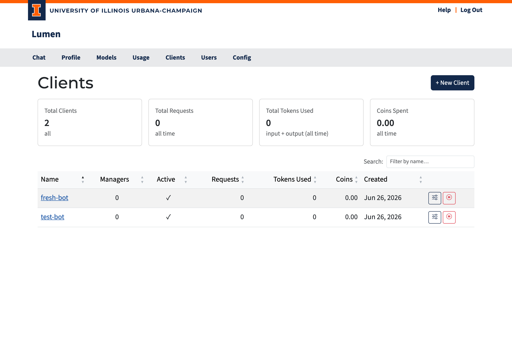

# Clients

The **Clients** page (`/clients`) is where you manage application clients — named identities for services or automated processes that need their own API access.

## What Is a Client?

A **client** is a named entity separate from your personal user account. It has its own API keys, coin pool, and usage counters. Clients are useful when you need to:

- Build an application or service that calls AI models on behalf of users
- Run automated pipelines or scripts that need stable, long-lived credentials
- Separate application usage from your personal usage and budget
- Allow a team to share access to a set of credentials without sharing anyone's personal key

Think of a client as a service account: it has a name (e.g., `research-bot`, `data-pipeline`), it accumulates its own usage history, and its API keys are managed independently.

## Who Can See What

| Role | Visibility |
|------|-----------|
| **Admin** | All clients in the system |
| **Manager** | Only clients they are assigned to manage |

If you are a manager of one or more clients, you will see them listed here. If you don't see the Clients page at all, your account has not been assigned as a manager of any client.

## Summary Cards

At the top of the page, four cards summarize the clients you can see:

| Card | Description |
|------|-------------|
| **Total Clients** | Number of clients visible to you |
| **Total Requests** | Combined API requests across all visible clients |
| **Total Tokens Used** | Combined input + output tokens |
| **Coins Spent** | Combined coin cost |

## Client Table

| Column | Description |
|--------|------------|
| **Name** | Clickable link to the client detail page |
| **Managers** | Number of users who manage this client |
| **Active** | Green checkmark for active, red X for deactivated |
| **Requests** | Total API requests |
| **Tokens Used** | Total input + output tokens |
| **Coins** | Total coins spent |
| **Created** | When the client was created |

Click any column header to sort. Use the search box to filter by name.

## Creating a Client

Only administrators can create new clients:

1. Click **+ New Client**.
2. Enter a name (e.g., `my-service-app`).
3. Click **Create**.

You will be redirected to the new client's detail page where you can set up managers and API keys.
