# Database Schema

All timestamps are stored as UTC without timezone info. Coin values use `Numeric(12, 6)` precision.

## UML Entity-Relationship Diagram

```mermaid
erDiagram
    entities {
        int id PK
        string entity_type
        string email
        string name
        string initials
        string gravatar_hash
        bool active
        datetime created_at
        string model_access_default
    }

    api_keys {
        int id PK
        int entity_id FK
        string name
        string key_hash
        string key_hint
        bool active
        int requests
        bigint input_tokens
        bigint output_tokens
        numeric cost
        datetime last_used_at
        datetime created_at
    }

    model_configs {
        int id PK
        string model_name
        numeric input_cost_per_million
        numeric output_cost_per_million
        bool active
        text description
        string url
        int context_window
        int max_output_tokens
        bool supports_function_calling
        bool supports_reasoning
        json input_modalities
        json output_modalities
        string knowledge_cutoff
        text notice
        datetime created_at
    }

    model_endpoints {
        int id PK
        int model_config_id FK
        string url
        string api_key
        string model_name
        bool healthy
        datetime last_checked_at
        datetime created_at
    }

    entity_limits {
        int id PK
        int entity_id FK
        numeric max_coins
        numeric refresh_coins
        numeric starting_coins
        bool config_managed
    }

    entity_balances {
        int id PK
        int entity_id FK
        numeric coins_left
        datetime last_refill_at
    }

    entity_model_access {
        int id PK
        int entity_id FK
        int model_config_id FK
        string access_type
    }

    entity_model_consents {
        int id PK
        int entity_id FK
        int model_config_id FK
        datetime consented_at
    }

    groups {
        int id PK
        string name
        text description
        bool active
        bool config_managed
        string model_access_default
        datetime created_at
    }

    group_members {
        int id PK
        int group_id FK
        int entity_id FK
        bool config_managed
    }

    group_limits {
        int id PK
        int group_id FK
        numeric max_coins
        numeric refresh_coins
        numeric starting_coins
    }

    group_model_access {
        int id PK
        int group_id FK
        int model_config_id FK
        string access_type
    }

    entity_managers {
        int id PK
        int user_entity_id FK
        int client_entity_id FK
    }

    model_stats {
        int id PK
        int entity_id FK
        int model_config_id FK
        string source
        int requests
        bigint input_tokens
        bigint output_tokens
        numeric cost
        datetime last_used_at
    }

    conversations {
        int id PK
        int entity_id FK
        string title
        string model
        bool hidden
        datetime created_at
        datetime updated_at
    }

    messages {
        int id PK
        int conversation_id FK
        string role
        text content
        datetime created_at
        int input_tokens
        int output_tokens
        float time_to_first_token
        float duration
        float output_speed
    }

    request_logs {
        datetime time PK
        int entity_id FK
        int model_config_id FK
        int model_endpoint_id FK
        string source
        int input_tokens
        int output_tokens
        numeric cost
        float duration
    }

    entities ||--o{ api_keys : "owns"
    entities ||--o| entity_limits : "has"
    entities ||--o| entity_balances : "has"
    entities ||--o{ entity_model_access : "overrides"
    entities ||--o{ entity_model_consents : "consents"
    entities ||--o{ model_stats : "accumulates"
    entities ||--o{ conversations : "owns"
    entities ||--o{ group_members : "belongs to"
    entities ||--o{ request_logs : "logs"
    entities ||--o{ entity_managers : "manages (user)"
    entities ||--o{ entity_managers : "managed by (client)"

    groups ||--o{ group_members : "contains"
    groups ||--o| group_limits : "has"
    groups ||--o{ group_model_access : "overrides"

    model_configs ||--o{ model_endpoints : "served by"
    model_configs ||--o{ entity_model_access : "controlled by"
    model_configs ||--o{ entity_model_consents : "consented via"
    model_configs ||--o{ group_model_access : "controlled by"
    model_configs ||--o{ model_stats : "accumulates"
    model_configs ||--o{ request_logs : "logs"

    model_endpoints ||--o{ request_logs : "logs"

    conversations ||--o{ messages : "contains"
```



## Tables

- [entities](#entities)
- [api\_keys](#api_keys)
- [model\_configs](#model_configs)
- [model\_endpoints](#model_endpoints)
- [entity\_limits](#entity_limits)
- [entity\_balances](#entity_balances)
- [entity\_model\_access](#entity_model_access)
- [entity\_model\_consents](#entity_model_consents)
- [groups](#groups)
- [group\_members](#group_members)
- [group\_limits](#group_limits)
- [group\_model\_access](#group_model_access)
- [entity\_managers](#entity_managers)
- [model\_stats](#model_stats)
- [conversations](#conversations)
- [messages](#messages)
- [request\_logs](#request_logs)

---

## entities

Unified table for both human users (authenticated via OAuth) and programmatic clients (authenticated via API keys). The `entity_type` column distinguishes them.

| Column | Type | Nullable | Description |
|--------|------|----------|-------------|
| `id` | Integer | NO | Primary key |
| `entity_type` | String(8) | NO | `'user'` for human users, `'client'` for API clients |
| `email` | String(256) | YES | Email address; populated for users, null for clients. Unique across users. |
| `name` | String(256) | NO | Display name |
| `initials` | String(4) | NO | Short initials used in UI avatars |
| `gravatar_hash` | String(64) | YES | MD5 hash of the user's email for Gravatar lookups; users only |
| `active` | Boolean | NO | Whether the entity can make requests. Inactive entities are blocked. |
| `created_at` | DateTime | NO | UTC timestamp when the entity was created |
| `model_access_default` | String(16) | YES | Default access policy for models not explicitly listed: `'whitelist'`, `'blacklist'`, or `'graylist'`. Used for client entities; users inherit from group membership. |

**Notes:**
- All foreign keys that reference `entities.id` cascade on delete.
- `model_access_default` combined with `entity_model_access` rows implements per-entity model allow/deny/consent lists.

---

## api_keys

API keys that entities (users or clients) use to authenticate against the proxy API. Keys are stored only as a bcrypt hash; the plaintext is shown once at creation.

| Column | Type | Nullable | Description |
|--------|------|----------|-------------|
| `id` | Integer | NO | Primary key |
| `entity_id` | Integer (FK → entities) | NO | The entity that owns this key. Cascades on delete. |
| `name` | String(128) | NO | Human-readable label for the key (e.g., "Production bot") |
| `key_hash` | String(64) | YES | SHA-256 hash of the raw key. Unique; null only during legacy migration. |
| `key_hint` | String(32) | YES | Last few characters of the raw key shown in the UI for identification |
| `active` | Boolean | NO | Whether the key is currently usable |
| `requests` | Integer | NO | Cumulative request count made with this key |
| `input_tokens` | BigInteger | NO | Cumulative input tokens consumed via this key |
| `output_tokens` | BigInteger | NO | Cumulative output tokens produced via this key |
| `cost` | Numeric(12,6) | NO | Cumulative cost in USD charged through this key |
| `last_used_at` | DateTime | YES | UTC timestamp of the most recent request; null if never used |
| `created_at` | DateTime | NO | UTC timestamp when the key was created |

---

## model_configs

Configuration and metadata for each AI model that Lumen can proxy. One row per logical model name (e.g., `gpt-4o`). Actual backend connectivity is in `model_endpoints`.

| Column | Type | Nullable | Description |
|--------|------|----------|-------------|
| `id` | Integer | NO | Primary key |
| `model_name` | String(128) | NO | Canonical model identifier sent to clients (e.g., `gpt-4o`). Unique. |
| `input_cost_per_million` | Numeric(12,6) | NO | USD cost per one million input tokens |
| `output_cost_per_million` | Numeric(12,6) | NO | USD cost per one million output tokens |
| `active` | Boolean | NO | Whether the model is available for use. Inactive models are hidden from clients. |
| `description` | Text | YES | Human-readable description shown in the UI |
| `url` | String(512) | YES | Link to the model's documentation or provider page |
| `max_input_tokens` | Integer | YES | Maximum context window size in tokens (deprecated; use `context_window`) |
| `supports_function_calling` | Boolean | YES | Whether the model supports tool/function-calling |
| `input_modalities` | JSON | YES | List of supported input types, e.g., `["text", "image"]` |
| `output_modalities` | JSON | YES | List of supported output types, e.g., `["text"]` |
| `context_window` | Integer | YES | Total context window in tokens (input + output) |
| `max_output_tokens` | Integer | YES | Maximum tokens the model can generate in a single response |
| `supports_reasoning` | Boolean | YES | Whether the model exposes chain-of-thought / reasoning tokens |
| `knowledge_cutoff` | String(7) | YES | Training data cutoff in `YYYY-MM` format |
| `notice` | Text | YES | Optional admin notice displayed to users on the model detail page |
| `created_at` | DateTime | NO | UTC timestamp when the model was registered |

---

## model_endpoints

Backend endpoint(s) for a model. A single `model_config` can fan out to multiple endpoints for load distribution or failover. Lumen routes requests to healthy endpoints.

| Column | Type | Nullable | Description |
|--------|------|----------|-------------|
| `id` | Integer | NO | Primary key |
| `model_config_id` | Integer (FK → model_configs) | NO | The model this endpoint serves. Cascades on delete. |
| `url` | String(256) | NO | Base URL of the backend (e.g., `https://api.openai.com/v1`) |
| `api_key` | String(256) | NO | Credential used when forwarding requests to this endpoint |
| `model_name` | String(128) | YES | Override model name sent to this endpoint. When set, Lumen substitutes this value for `model_config.model_name` in upstream requests, enabling one Lumen model to map to differently-named backend models. |
| `healthy` | Boolean | NO | Last known health status; updated by the health-check background task |
| `last_checked_at` | DateTime | YES | UTC timestamp of the most recent health check; null if never checked |
| `created_at` | DateTime | NO | UTC timestamp when the endpoint was added |

---

## entity_limits

Budget configuration for a single entity. Each entity has at most one limit row. Coin semantics: `-2` = unlimited, `0` = blocked, positive value = coin budget.

| Column | Type | Nullable | Description |
|--------|------|----------|-------------|
| `id` | Integer | NO | Primary key |
| `entity_id` | Integer (FK → entities) | NO | The entity this limit applies to. Unique; one row per entity. Cascades on delete. |
| `max_coins` | Numeric(12,6) | NO | Maximum coins the entity may hold at any time. `-2` = unlimited, `0` = blocked. |
| `refresh_coins` | Numeric(12,6) | NO | Coins added at each periodic refill cycle |
| `starting_coins` | Numeric(12,6) | NO | Coins granted when the entity is first created or reset |
| `config_managed` | Boolean | NO | When `true`, this row is owned by `config.yaml` and must not be edited through the UI |

---

## entity_balances

Current coin balance for each entity. Updated on every request and on each refill cycle.

| Column | Type | Nullable | Description |
|--------|------|----------|-------------|
| `id` | Integer | NO | Primary key |
| `entity_id` | Integer (FK → entities) | NO | The entity this balance belongs to. Unique; one row per entity. Cascades on delete. |
| `coins_left` | Numeric(12,6) | NO | Current spendable coin balance |
| `last_refill_at` | DateTime | NO | UTC timestamp of the most recent coin refill |

---

## entity_model_access

Per-entity model access overrides. Each row designates a specific model as whitelisted, blacklisted, or graylisted for the entity. The entity's `model_access_default` handles models not listed here.

| Column | Type | Nullable | Description |
|--------|------|----------|-------------|
| `id` | Integer | NO | Primary key |
| `entity_id` | Integer (FK → entities) | NO | The entity the override applies to. Cascades on delete. |
| `model_config_id` | Integer (FK → model_configs) | NO | The model being overridden. Cascades on delete. |
| `access_type` | String(20) | NO | `'whitelist'` (always allowed), `'blacklist'` (always denied), or `'graylist'` (allowed after explicit user consent) |

**Constraints:** `UNIQUE(entity_id, model_config_id)`

**Access type semantics:**
- `whitelist` — entity may use this model regardless of group or default policy.
- `blacklist` — entity is blocked from this model regardless of group or default policy.
- `graylist` — entity must consent (via `entity_model_consents`) before using the model.

---

## entity_model_consents

Records that an entity has explicitly accepted the terms or notice for a graylisted model. A row here is required before a graylisted model can be used.

| Column | Type | Nullable | Description |
|--------|------|----------|-------------|
| `id` | Integer | NO | Primary key |
| `entity_id` | Integer (FK → entities) | NO | The consenting entity. Cascades on delete. |
| `model_config_id` | Integer (FK → model_configs) | NO | The model for which consent was given. Cascades on delete. |
| `consented_at` | DateTime | NO | UTC timestamp when the entity accepted the model notice |

**Constraints:** `UNIQUE(entity_id, model_config_id)`

---

## groups

Named collections of entities used for bulk policy assignment. Groups can be managed manually through the admin UI or driven entirely from `config.yaml` (see `config_managed`).

| Column | Type | Nullable | Description |
|--------|------|----------|-------------|
| `id` | Integer | NO | Primary key |
| `name` | String(128) | NO | Unique group identifier (e.g., `faculty`, `students`) |
| `description` | Text | YES | Optional human-readable description shown in the admin UI |
| `active` | Boolean | NO | Whether the group is currently in effect |
| `config_managed` | Boolean | NO | When `true`, group membership and settings are controlled by `config.yaml` |
| `model_access_default` | String(20) | YES | Default access policy for models not explicitly listed in `group_model_access`: `'whitelist'`, `'blacklist'`, or `'graylist'` |
| `created_at` | DateTime | NO | UTC timestamp when the group was created |

---

## group_members

Association table linking entities to groups. An entity may belong to multiple groups.

| Column | Type | Nullable | Description |
|--------|------|----------|-------------|
| `id` | Integer | NO | Primary key |
| `group_id` | Integer (FK → groups) | NO | The group. Cascades on delete. |
| `entity_id` | Integer (FK → entities) | NO | The entity that belongs to the group. Cascades on delete. |
| `config_managed` | Boolean | NO | When `true`, this membership was created by `config.yaml` and must not be removed via the UI |

**Constraints:** `UNIQUE(group_id, entity_id)`

---

## group_limits

Coin budget configuration for a group. Works identically to `entity_limits` but applies to all members of the group unless overridden at the entity level.

| Column | Type | Nullable | Description |
|--------|------|----------|-------------|
| `id` | Integer | NO | Primary key |
| `group_id` | Integer (FK → groups) | NO | The group this limit applies to. Unique; one row per group. Cascades on delete. |
| `max_coins` | Numeric(12,6) | NO | Maximum coins the group may hold at any time. `-2` = unlimited, `0` = blocked. |
| `refresh_coins` | Numeric(12,6) | NO | Coins added at each periodic refill cycle |
| `starting_coins` | Numeric(12,6) | NO | Coins granted when the group is first created or reset |

---

## group_model_access

Per-group model access overrides. Mirrors `entity_model_access` but applies to all members of the group. Entity-level overrides take precedence over group-level overrides.

| Column | Type | Nullable | Description |
|--------|------|----------|-------------|
| `id` | Integer | NO | Primary key |
| `group_id` | Integer (FK → groups) | NO | The group the override applies to. Cascades on delete. |
| `model_config_id` | Integer (FK → model_configs) | NO | The model being overridden. Cascades on delete. |
| `access_type` | String(20) | NO | `'whitelist'`, `'blacklist'`, or `'graylist'` — same semantics as `entity_model_access.access_type` |

**Constraints:** `UNIQUE(group_id, model_config_id)`

---

## entity_managers

Maps users to the client entities they are permitted to manage. A manager can view and administer a client's API keys and usage.

| Column | Type | Nullable | Description |
|--------|------|----------|-------------|
| `id` | Integer | NO | Primary key |
| `user_entity_id` | Integer (FK → entities) | NO | The user (must be `entity_type = 'user'`) who has management rights. Cascades on delete. |
| `client_entity_id` | Integer (FK → entities) | NO | The client entity being managed. Cascades on delete. |

**Constraints:** `UNIQUE(user_entity_id, client_entity_id)`

---

## model_stats

Running aggregated usage counters per entity per model per source. Updated after every proxied request. Used for the usage dashboard.

| Column | Type | Nullable | Description |
|--------|------|----------|-------------|
| `id` | Integer | NO | Primary key |
| `entity_id` | Integer (FK → entities) | NO | The entity that made the requests. Cascades on delete. |
| `model_config_id` | Integer (FK → model_configs) | NO | The model used. Cascades on delete. |
| `source` | String(8) | NO | Origin of the request: `'chat'` (web UI) or `'api'` (API key) |
| `requests` | Integer | NO | Total number of requests |
| `input_tokens` | BigInteger | NO | Total input tokens consumed |
| `output_tokens` | BigInteger | NO | Total output tokens produced |
| `cost` | Numeric(12,6) | NO | Total cost in USD |
| `last_used_at` | DateTime | NO | UTC timestamp of the most recent request counted in this row |

**Constraints:** `UNIQUE(entity_id, model_config_id, source)`

---

## conversations

Chat sessions created through the Lumen web UI. Each conversation belongs to a single entity and holds an ordered list of messages.

| Column | Type | Nullable | Description |
|--------|------|----------|-------------|
| `id` | Integer | NO | Primary key |
| `entity_id` | Integer (FK → entities) | NO | The entity (user) who owns the conversation. Cascades on delete. |
| `title` | String(40) | NO | Short auto-generated or user-edited title |
| `model` | String(128) | NO | Model name used in this conversation (snapshot at creation time) |
| `hidden` | Boolean | NO | When `true`, the conversation is soft-deleted and not shown in the UI |
| `created_at` | DateTime | NO | UTC timestamp when the conversation was created |
| `updated_at` | DateTime | NO | UTC timestamp of the most recent message or edit |

---

## messages

Individual turns within a conversation. Both user and assistant messages are stored here.

| Column | Type | Nullable | Description |
|--------|------|----------|-------------|
| `id` | Integer | NO | Primary key |
| `conversation_id` | Integer (FK → conversations) | NO | The conversation this message belongs to. Cascades on delete. |
| `role` | String(16) | NO | Speaker role: `'user'`, `'assistant'`, or `'system'` |
| `content` | Text | NO | Full message text |
| `created_at` | DateTime | NO | UTC timestamp when the message was created |
| `input_tokens` | Integer | YES | Input tokens reported by the model; assistant messages only |
| `output_tokens` | Integer | YES | Output tokens reported by the model; assistant messages only |
| `time_to_first_token` | Float | YES | Seconds from request send to first token received; assistant messages only |
| `duration` | Float | YES | Total response time in seconds; assistant messages only |
| `output_speed` | Float | YES | Output tokens per second; assistant messages only |

---

## request_logs

Append-only log of every proxied request. On PostgreSQL this table is converted to a TimescaleDB hypertable partitioned by `time`, enabling efficient time-range queries and retention policies. On SQLite it behaves as a plain table.

| Column | Type | Nullable | Description |
|--------|------|----------|-------------|
| `time` | DateTime (with timezone) | NO | UTC timestamp of the request; serves as the primary key and TimescaleDB partition key |
| `entity_id` | Integer (FK → entities) | YES | The entity that made the request; set to NULL if the entity is later deleted |
| `model_config_id` | Integer (FK → model_configs) | YES | The model used; set to NULL if the model is later deleted |
| `model_endpoint_id` | Integer (FK → model_endpoints) | YES | The specific backend endpoint that served the request; set to NULL if the endpoint is later deleted |
| `source` | String(8) | NO | Origin of the request: `'chat'` or `'api'` |
| `input_tokens` | Integer | NO | Input token count for this request |
| `output_tokens` | Integer | NO | Output token count for this request |
| `cost` | Numeric(12,6) | NO | Cost in USD for this request |
| `duration` | Float | NO | Total proxy response time in seconds |

**Notes:**
- Foreign keys use `SET NULL` on delete (not cascade) to preserve historical log data when entities, models, or endpoints are removed.
- On PostgreSQL, `time` must be unique at the nanosecond level. High-concurrency deployments should append a nanosecond jitter when inserting to avoid collisions.

---

## Entity Relationship Overview

```
groups ──< group_members >── entities ──< api_keys
  │                              │
  ├──< group_limits              ├──< entity_limits
  │                              ├──< entity_balances
  └──< group_model_access        ├──< entity_model_access
                                 ├──< entity_model_consents
model_configs ──< model_endpoints├──< entity_managers (user→client)
     │                           ├──< model_stats
     ├──< entity_model_access    ├──< conversations ──< messages
     ├──< group_model_access     └──< request_logs
     └──< model_stats / request_logs
```

## Access Control Evaluation Order

When determining whether an entity may use a model, Lumen evaluates in this priority order:

1. **Entity-level** `entity_model_access` row for the model → if present, use its `access_type`.
2. **Group-level** `group_model_access` row for any group the entity belongs to → if found, use its `access_type`.
3. **Entity default** `entities.model_access_default` → if set, use it.
4. **Group default** `groups.model_access_default` → for any group the entity belongs to.
5. **Deny** — if no rule applies, access is denied.

For `graylist` access, the entity must also have a row in `entity_model_consents` for the model.
