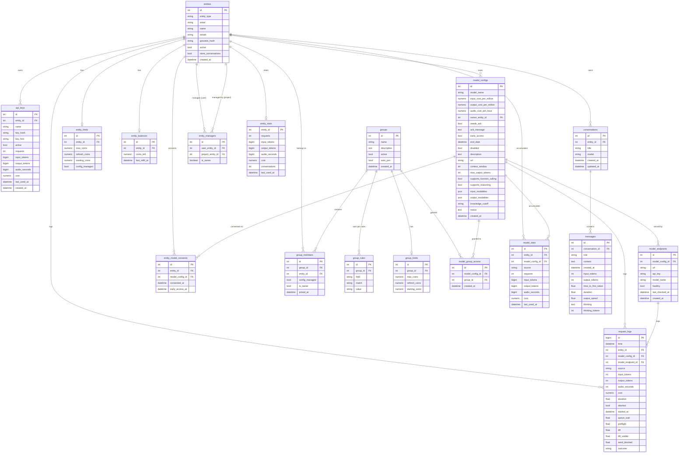

# Database Schema

All timestamps are stored as UTC without timezone info. Coin values use `Numeric(12, 6)` precision.

## UML Entity-Relationship Diagram


```mermaid
erDiagram
    entities {
        int id PK
        string entity_type
        string email
        string name
        string initials
        string gravatar_hash
        bool active
        bool store_conversations
        datetime created_at
    }

    api_keys {
        int id PK
        int entity_id FK
        string name
        string key_hash
        string key_hint
        bool active
        int requests
        bigint input_tokens
        bigint output_tokens
        bigint audio_seconds
        numeric cost
        datetime last_used_at
        datetime created_at
    }

    model_configs {
        int id PK
        string model_name
        numeric input_cost_per_million
        numeric output_cost_per_million
        numeric audio_cost_per_hour
        int owner_entity_id FK
        bool needs_ack
        text ack_message
        bool early_access
        datetime end_date
        bool disabled
        text description
        string url
        int context_window
        int max_output_tokens
        bool supports_function_calling
        bool supports_reasoning
        json input_modalities
        json output_modalities
        string knowledge_cutoff
        text notice
        datetime created_at
    }

    model_endpoints {
        int id PK
        int model_config_id FK
        string url
        string api_key
        string model_name
        bool healthy
        datetime last_checked_at
        datetime created_at
    }

    entity_limits {
        int id PK
        int entity_id FK
        numeric max_coins
        numeric refresh_coins
        numeric starting_coins
        bool config_managed
    }

    entity_balances {
        int id PK
        int entity_id FK
        numeric coins_left
        datetime last_refill_at
    }

    entity_model_consents {
        int id PK
        int entity_id FK
        int model_config_id FK
        datetime consented_at
        datetime early_access_at
    }

    groups {
        int id PK
        string name
        text description
        bool active
        bool auto_join
        datetime created_at
    }

    group_members {
        int id PK
        int group_id FK
        int entity_id FK
        bool config_managed
        bool is_owner
        datetime joined_at
    }

    group_rules {
        int id PK
        int group_id FK
        string field
        string match
        string value
    }

    group_limits {
        int id PK
        int group_id FK
        numeric max_coins
        numeric refresh_coins
        numeric starting_coins
    }

    model_group_access {
        int id PK
        int model_config_id FK
        int group_id FK
        datetime created_at
    }

    entity_managers {
        int id PK
        int user_entity_id FK
        int project_entity_id FK
        boolean is_owner
    }

    model_stats {
        int id PK
        int entity_id FK
        int model_config_id FK
        string source
        int requests
        bigint input_tokens
        bigint output_tokens
        bigint audio_seconds
        numeric cost
        datetime last_used_at
    }

    entity_stats {
        int entity_id PK
        int requests
        bigint input_tokens
        bigint output_tokens
        bigint audio_seconds
        numeric cost
        int conversations
        datetime last_used_at
    }

    conversations {
        int id PK
        int entity_id FK
        string title
        string model
        datetime created_at
        datetime updated_at
    }

    messages {
        int id PK
        int conversation_id FK
        string role
        text content
        datetime created_at
        int input_tokens
        int output_tokens
        float time_to_first_token
        float duration
        float output_speed
        text thinking
        int thinking_tokens
    }

    request_logs {
        bigint id PK
        datetime time
        int entity_id FK
        int model_config_id FK
        int model_endpoint_id FK
        string source
        int input_tokens
        int output_tokens
        int audio_seconds
        numeric cost
        float duration
        bool aborted
        datetime started_at
        float queue_wait
        float preflight
        float ttft
        float ttft_visible
        float send_blocked
        string outcome
    }

    entities ||--o{ api_keys : "owns"
    entities ||--o| entity_limits : "has"
    entities ||--o| entity_balances : "has"
    entities ||--o{ model_configs : "owns"
    entities ||--o{ entity_model_consents : "consents"
    entities ||--o{ model_stats : "accumulates"
    entities ||--o| entity_stats : "totals"
    entities ||--o{ conversations : "owns"
    entities ||--o{ group_members : "belongs to"
    entities ||--o{ request_logs : "logs"
    entities ||--o{ entity_managers : "manages (user)"
    entities ||--o{ entity_managers : "managed by (project)"

    groups ||--o{ group_members : "contains"
    groups ||--o{ group_rules : "auto-join rules"
    groups ||--o| group_limits : "has"
    groups ||--o{ model_group_access : "granted"

    model_configs ||--o{ model_endpoints : "served by"
    model_configs ||--o{ entity_model_consents : "consented via"
    model_configs ||--o{ model_group_access : "granted to"
    model_configs ||--o{ model_stats : "accumulates"
    model_configs ||--o{ request_logs : "logs"

    model_endpoints ||--o{ request_logs : "logs"

    conversations ||--o{ messages : "contains"
```

## Tables

- [entities](#entities)
- [api\_keys](#api_keys)
- [model\_configs](#model_configs)
- [model\_endpoints](#model_endpoints)
- [entity\_limits](#entity_limits)
- [entity\_balances](#entity_balances)
- [entity\_model\_consents](#entity_model_consents)
- [groups](#groups)
- [group\_members](#group_members)
- [group\_rules](#group_rules)
- [group\_limits](#group_limits)
- [model\_group\_access](#model_group_access)
- [entity\_managers](#entity_managers)
- [model\_stats](#model_stats)
- [entity\_stats](#entity_stats)
- [conversations](#conversations)
- [messages](#messages)
- [request\_logs](#request_logs)
- [request\_counts\_hourly\_by\_entity](#request_counts_hourly_by_entity) *(continuous aggregate)*
- [request\_metrics\_1m](#request_metrics_1m) *(continuous aggregate)*

---

## entities

Unified table for both human users (authenticated via OAuth) and programmatic projects (authenticated via API keys). The `entity_type` column distinguishes them.

| Column | Type | Nullable | Description |
|--------|------|----------|-------------|
| `id` | Integer | NO | Primary key |
| `entity_type` | String(8) | NO | `'user'` for human users, `'project'` for API projects |
| `email` | String(256) | YES | Email address; populated for users, null for projects. Unique across users. |
| `name` | String(256) | NO | Display name |
| `initials` | String(4) | NO | Short initials used in UI avatars |
| `gravatar_hash` | String(64) | YES | MD5 hash of the user's email for Gravatar lookups; users only |
| `active` | Boolean | NO | Whether the entity can make requests. Inactive entities are blocked. |
| `store_conversations` | Boolean | NO | Whether webchat conversations are persisted for this user. Default `true`. |
| `created_at` | DateTime | NO | UTC timestamp when the entity was created |

**Notes:**
- All foreign keys that reference `entities.id` cascade on delete, except `model_configs.owner_entity_id` and the `request_logs` FKs, which use `SET NULL`.
- Acknowledgement (`needs_ack`) is a property of the model, not of the entity.

---

## api_keys

API keys that entities (users or projects) use to authenticate against the proxy API. Keys are stored only as a bcrypt hash; the plaintext is shown once at creation.

| Column | Type | Nullable | Description |
|--------|------|----------|-------------|
| `id` | Integer | NO | Primary key |
| `entity_id` | Integer (FK → entities) | NO | The entity that owns this key. Cascades on delete. |
| `name` | String(128) | NO | Human-readable label for the key (e.g., "Production bot") |
| `key_hash` | String(64) | NO | SHA-256 hash of the raw key. Unique. |
| `key_hint` | String(32) | YES | Last few characters of the raw key shown in the UI for identification |
| `active` | Boolean | NO | Whether the key is currently usable |
| `requests` | Integer | NO | Cumulative request count made with this key |
| `input_tokens` | BigInteger | NO | Cumulative input tokens consumed via this key |
| `output_tokens` | BigInteger | NO | Cumulative output tokens produced via this key |
| `audio_seconds` | BigInteger | NO | Cumulative seconds of audio transcribed/translated via this key |
| `cost` | Numeric(12,6) | NO | Cumulative cost in USD charged through this key |
| `last_used_at` | DateTime | YES | UTC timestamp of the most recent request; null if never used |
| `created_at` | DateTime | NO | UTC timestamp when the key was created |

---

## model_configs

Configuration and metadata for each AI model that Lumen can proxy. One row per logical model name (e.g., `gpt-4o`). Actual backend connectivity is in `model_endpoints`.

| Column | Type | Nullable | Description |
|--------|------|----------|-------------|
| `id` | Integer | NO | Primary key |
| `model_name` | String(128) | NO | Canonical model identifier sent to clients (e.g., `gpt-4o`). Unique. |
| `input_cost_per_million` | Numeric(12,6) | NO | USD cost per one million input tokens |
| `output_cost_per_million` | Numeric(12,6) | NO | USD cost per one million output tokens |
| `audio_cost_per_hour` | Numeric(12,6) | YES | USD cost per hour of audio; only set for speech-to-text (ASR) models |
| `owner_entity_id` | Integer (FK → entities) | YES | Owning user entity; NULL = available to everyone. When set, only the owner and members of granted groups may use the model. `SET NULL` on delete — deleting the owner makes the model public again. |
| `needs_ack` | Boolean | NO | Requires user acknowledgement before use; a sticky model-level property that no scope can add or remove. Default `false`. |
| `ack_message` | Text | YES | Per-model acknowledgement message; overrides the global `defaults.models.ack_message`. |
| `early_access` | Boolean | NO | Early-access model: users must acknowledge it may change or be removed before use. A sticky model-level property like `needs_ack`. Default `false`. |
| `end_date` | DateTime | YES | Naive-UTC datetime after which the model is hidden everywhere and rejected (exclusive comparison). NULL = no end date. |
| `disabled` | Boolean | NO | Hard off: the model is hidden everywhere and not overridable by any scope. Default `false`. |
| `description` | Text | YES | Human-readable description shown in the UI |
| `url` | String(512) | YES | Link to the model's documentation or provider page |
| `supports_function_calling` | Boolean | YES | Whether the model supports tool/function-calling |
| `input_modalities` | JSON | YES | List of supported input types, e.g., `["text", "image"]` |
| `output_modalities` | JSON | YES | List of supported output types, e.g., `["text"]` |
| `context_window` | Integer | YES | Total context window in tokens (input + output) |
| `max_output_tokens` | Integer | YES | Maximum tokens the model can generate in a single response |
| `supports_reasoning` | Boolean | YES | Whether the model exposes chain-of-thought / reasoning tokens |
| `knowledge_cutoff` | String(7) | YES | Training data cutoff in `YYYY-MM` format |
| `notice` | Text | YES | Optional admin notice displayed to users on the model detail page |
| `created_at` | DateTime | NO | UTC timestamp when the model was registered |

**Notes:**
- `active` is a derived, read-only property (`active = not disabled and (end_date is null or end_date > now)`), not a stored column. It replaces the old `active` column.
- `owner_entity_id` and the `model_group_access` grants are DB-managed (edited via the model detail page), never synced from `config.yaml`.

---

## model_endpoints

Backend endpoint(s) for a model. A single `model_config` can fan out to multiple endpoints for load distribution or failover. Lumen routes requests to healthy endpoints.

| Column | Type | Nullable | Description |
|--------|------|----------|-------------|
| `id` | Integer | NO | Primary key |
| `model_config_id` | Integer (FK → model_configs) | NO | The model this endpoint serves. Cascades on delete. |
| `url` | String(256) | NO | Base URL of the backend (e.g., `https://api.openai.com/v1`) |
| `api_key` | String(256) | NO | Credential used when forwarding requests to this endpoint |
| `model_name` | String(128) | YES | Override model name sent to this endpoint. When set, Lumen substitutes this value for `model_config.model_name` in upstream requests, enabling one Lumen model to map to differently-named backend models. |
| `healthy` | Boolean | NO | Last known health status; updated by the health-check background task |
| `last_checked_at` | DateTime | YES | UTC timestamp of the most recent health check; null if never checked |
| `created_at` | DateTime | NO | UTC timestamp when the endpoint was added |

---

## entity_limits

Budget configuration for a single entity. Each entity has at most one limit row. Coin semantics: `-2` = unlimited, `0` = blocked, positive value = coin budget.

| Column | Type | Nullable | Description |
|--------|------|----------|-------------|
| `id` | Integer | NO | Primary key |
| `entity_id` | Integer (FK → entities) | NO | The entity this limit applies to. Unique; one row per entity. Cascades on delete. |
| `max_coins` | Numeric(12,6) | NO | Maximum coins the entity may hold at any time. `-2` = unlimited, `0` = blocked. |
| `refresh_coins` | Numeric(12,6) | NO | Coins added at each periodic refill cycle |
| `starting_coins` | Numeric(12,6) | NO | Coins granted when the entity is first created or reset |
| `config_managed` | Boolean | NO | Historical: `true` on rows created by the old `config.yaml` limit sync. Rows edited through the project/profile Edit dialogs are set to `false`. |

---

## entity_balances

Current coin balance for each entity. Updated on every request and on each refill cycle.

| Column | Type | Nullable | Description |
|--------|------|----------|-------------|
| `id` | Integer | NO | Primary key |
| `entity_id` | Integer (FK → entities) | NO | The entity this balance belongs to. Unique; one row per entity. Cascades on delete. |
| `coins_left` | Numeric(12,6) | NO | Current spendable coin balance |
| `last_refill_at` | DateTime | NO | UTC timestamp of the most recent coin refill |

---

## entity_model_consents

Records that an entity has acknowledged a model's requirements. A model can carry two acknowledgement requirements — `needs_ack` (tracked in `consented_at`) and `early_access` (tracked in `early_access_at`). A requirement is satisfied when its timestamp is set; if a model gains a requirement after the entity consented, the new requirement's timestamp is NULL and the entity is prompted to acknowledge again (a single combined dialog covers all outstanding requirements).

| Column | Type | Nullable | Description |
|--------|------|----------|-------------|
| `id` | Integer | NO | Primary key |
| `entity_id` | Integer (FK → entities) | NO | The consenting entity. Cascades on delete. |
| `model_config_id` | Integer (FK → model_configs) | NO | The model for which consent was given. Cascades on delete. |
| `consented_at` | DateTime | YES | UTC timestamp when the entity acknowledged the model notice (`needs_ack`); NULL if never required |
| `early_access_at` | DateTime | YES | UTC timestamp when the entity acknowledged the early-access warning; NULL if never required |

**Constraints:** `UNIQUE(entity_id, model_config_id)`

---

## groups

Named collections of entities used for bulk policy assignment. Groups are managed entirely in the database via the Groups pages; a group with `auto_join` assigns membership at OAuth login to users matching all of its [group\_rules](#group_rules).

| Column | Type | Nullable | Description |
|--------|------|----------|-------------|
| `id` | Integer | NO | Primary key |
| `name` | String(128) | NO | Unique group identifier (e.g., `faculty`, `students`) |
| `description` | Text | YES | Optional human-readable description shown in the admin UI |
| `active` | Boolean | NO | Whether the group is currently in effect |
| `auto_join` | Boolean | NO | When `true`, users matching all of the group's rules are added as members at OAuth login |
| `created_at` | DateTime | NO | UTC timestamp when the group was created |

---

## group_members

Association table linking entities to groups. An entity may belong to multiple groups.

| Column | Type | Nullable | Description |
|--------|------|----------|-------------|
| `id` | Integer | NO | Primary key |
| `group_id` | Integer (FK → groups) | NO | The group. Cascades on delete. |
| `entity_id` | Integer (FK → entities) | NO | The entity that belongs to the group. Cascades on delete. |
| `config_managed` | Boolean | NO | When `true`, assigned automatically at login by the group's auto-join rules; reconciled (added/removed) at each login. Manual memberships are `false`. |
| `is_owner` | Boolean | NO | True for the group owner; at most one owner per group (enforced by app logic). The owner may add/remove members, transfer ownership, grant models they own, and deactivate the group. |
| `joined_at` | DateTime | YES | UTC timestamp when the membership was created; `NULL` for memberships that predate the column (join time unknown) |

**Constraints:** `UNIQUE(group_id, entity_id)`

---

## group_rules

Auto-join conditions per group, edited on the group detail page (admin-only Rules tab). A user matching **all** of a group's rules is added as a member at OAuth login; a group with `auto_join` but no rules matches nobody (fails closed).

| Column | Type | Nullable | Description |
|--------|------|----------|-------------|
| `id` | Integer | NO | Primary key |
| `group_id` | Integer (FK → groups) | NO | The group this rule belongs to. Cascades on delete. |
| `field` | String(128) | NO | Userinfo claim to inspect (e.g. `affiliation`, `idp`) |
| `match` | String(8) | NO | `contains` for substring match, `equals` for exact match |
| `value` | String(256) | NO | Value the claim is compared against |

**Constraints:** index on `group_id`

---

## group_limits

Coin budget configuration for a group. Works identically to `entity_limits` but applies to all members of the group unless overridden at the entity level.

| Column | Type | Nullable | Description |
|--------|------|----------|-------------|
| `id` | Integer | NO | Primary key |
| `group_id` | Integer (FK → groups) | NO | The group this limit applies to. Unique; one row per group. Cascades on delete. |
| `max_coins` | Numeric(12,6) | NO | Maximum coins the group may hold at any time. `-2` = unlimited, `0` = blocked. |
| `refresh_coins` | Numeric(12,6) | NO | Coins added at each periodic refill cycle |
| `starting_coins` | Numeric(12,6) | NO | Coins granted when the group is first created or reset |

---

## model_group_access

Group grants for owned models; a row gives all group members access to the model. Only meaningful for models with an `owner_entity_id` set — a model with no owner is available to everyone and needs no grants. Grants are edited by admins on the model detail page; deleting a granted group removes the grant.

| Column | Type | Nullable | Description |
|--------|------|----------|-------------|
| `id` | Integer | NO | Primary key |
| `model_config_id` | Integer (FK → model_configs) | NO | The owned model being granted. Cascades on delete. |
| `group_id` | Integer (FK → groups) | NO | The group whose members receive access. Cascades on delete. |
| `created_at` | DateTime | NO | UTC timestamp when the grant was created |

**Constraints:** `UNIQUE(model_config_id, group_id)` (`uq_mga_model_group`); index `ix_model_group_access_group_id` on `group_id`

---

## entity_managers

Maps users to the project entities they are permitted to manage. A manager can view and administer a project's API keys and usage. The `is_owner` flag designates the project owner — a manager who can additionally add/remove managers, transfer ownership, and activate/deactivate the project. At most one owner per project (enforced by app logic).

| Column | Type | Nullable | Description |
|--------|------|----------|-------------|
| `id` | Integer | NO | Primary key |
| `user_entity_id` | Integer (FK → entities) | NO | The user (must be `entity_type = 'user'`) who has management rights. Cascades on delete. |
| `project_entity_id` | Integer (FK → entities) | NO | The project entity being managed. Cascades on delete. |
| `is_owner` | Boolean | NO | True for the project owner; at most one owner per project (enforced by app logic). Default `false`. |

**Constraints:** `UNIQUE(user_entity_id, project_entity_id)`

---

## model_stats

Running aggregated usage counters per entity per model per source. Updated after every proxied request. Used for the usage dashboard.

| Column | Type | Nullable | Description |
|--------|------|----------|-------------|
| `id` | Integer | NO | Primary key |
| `entity_id` | Integer (FK → entities) | NO | The entity that made the requests. Cascades on delete. |
| `model_config_id` | Integer (FK → model_configs) | NO | The model used. Cascades on delete. |
| `source` | String(8) | NO | Origin of the request: `'chat'` (web UI) or `'api'` (API key) |
| `requests` | Integer | NO | Total number of requests |
| `input_tokens` | BigInteger | NO | Total input tokens consumed |
| `output_tokens` | BigInteger | NO | Total output tokens produced |
| `audio_seconds` | BigInteger | NO | Total seconds of audio transcribed/translated |
| `cost` | Numeric(12,6) | NO | Total cost in USD |
| `last_used_at` | DateTime | NO | UTC timestamp of the most recent request counted in this row |

**Constraints:** `UNIQUE(entity_id, model_config_id, source)`

---

## entity_stats

Pre-aggregated usage totals per entity across all models and sources. One row per entity, maintained atomically alongside `model_stats` on every proxied request. Enables O(1) per-entity lookups in the admin users table and projects listing without scanning `model_stats`.

| Column | Type | Nullable | Description |
|--------|------|----------|-------------|
| `entity_id` | Integer (PK, FK → entities) | NO | The entity these counters belong to. Cascades on delete. |
| `requests` | Integer | NO | Total request count across all models and sources |
| `input_tokens` | BigInteger | NO | Total input tokens consumed across all models and sources |
| `output_tokens` | BigInteger | NO | Total output tokens produced across all models and sources |
| `audio_seconds` | BigInteger | NO | Total seconds of audio transcribed/translated across all models and sources |
| `cost` | Numeric(12,6) | NO | Total cost in USD across all models and sources |
| `conversations` | Integer | NO | Total webchat conversations started. Retained even when conversations are deleted or storage is disabled. |
| `last_used_at` | DateTime | YES | UTC timestamp of the most recent request by this entity; null if never used |

**Notes:**
- Populated on migration by a `GROUP BY` backfill from `model_stats`.
- Always current — no refresh lag. Unlike `request_counts_hourly`, this is written synchronously with every request.

---

## conversations

Chat sessions created through the Lumen web UI. Each conversation belongs to a single entity and holds an ordered list of messages. Deleting a conversation permanently removes it and all its messages.

| Column | Type | Nullable | Description |
|--------|------|----------|-------------|
| `id` | Integer | NO | Primary key |
| `entity_id` | Integer (FK → entities) | NO | The entity (user) who owns the conversation. Cascades on delete. |
| `title` | String(40) | NO | Short auto-generated or user-edited title |
| `model` | String(128) | NO | Model name used in this conversation (snapshot at creation time) |
| `created_at` | DateTime | NO | UTC timestamp when the conversation was created |
| `updated_at` | DateTime | NO | UTC timestamp of the most recent message or edit |

---

## messages

Individual turns within a conversation. Both user and assistant messages are stored here.

| Column | Type | Nullable | Description |
|--------|------|----------|-------------|
| `id` | Integer | NO | Primary key |
| `conversation_id` | Integer (FK → conversations) | NO | The conversation this message belongs to. Cascades on delete. |
| `role` | String(16) | NO | Speaker role: `'user'`, `'assistant'`, or `'system'` |
| `content` | Text | NO | Full message text |
| `created_at` | DateTime | NO | UTC timestamp when the message was created |
| `input_tokens` | Integer | YES | Input tokens reported by the model; assistant messages only |
| `output_tokens` | Integer | YES | Output tokens reported by the model; assistant messages only |
| `time_to_first_token` | Float | YES | Seconds from request send to first token received; assistant messages only |
| `duration` | Float | YES | Total response time in seconds; assistant messages only |
| `output_speed` | Float | YES | Output tokens per second; assistant messages only |
| `thinking` | Text | YES | Reasoning/thinking content from the model; assistant messages only |
| `thinking_tokens` | Integer | YES | Thinking/reasoning token count reported by the model; assistant messages only |

---

## request_logs

Append-only log of every proxied request. On PostgreSQL this table is converted to a TimescaleDB hypertable partitioned by `time`, enabling efficient time-range queries and retention policies. On SQLite it behaves as a plain table.

| Column | Type | Nullable | Description |
|--------|------|----------|-------------|
| `id` | BigInteger | NO | Surrogate primary key (Integer on SQLite); avoids timestamp collision under concurrent load |
| `time` | DateTime (with timezone) | NO | UTC timestamp of the request; TimescaleDB partition key. Indexed but non-unique. |
| `entity_id` | Integer (FK → entities) | YES | The entity that made the request; set to NULL if the entity is later deleted |
| `model_config_id` | Integer (FK → model_configs) | YES | The model used; set to NULL if the model is later deleted |
| `model_endpoint_id` | Integer (FK → model_endpoints) | YES | The specific backend endpoint that served the request; set to NULL if the endpoint is later deleted |
| `source` | String(8) | NO | Origin of the request: `'chat'` or `'api'` |
| `input_tokens` | Integer | NO | Input token count for this request |
| `output_tokens` | Integer | NO | Output token count for this request |
| `audio_seconds` | Integer | NO | Seconds of audio transcribed/translated; 0 for text requests |
| `cost` | Numeric(12,6) | NO | Cost in USD for this request |
| `duration` | Float | NO | Total proxy response time in seconds |
| `aborted` | Boolean | NO | True if the client disconnected before the stream completed; token counts may be estimated |
| `started_at` | DateTime (with timezone) | YES | UTC instant the request arrived at the ASGI bridge (T0) |
| `queue_wait` | Float | YES | Seconds spent waiting for a WSGI worker thread (T1−T0) |
| `preflight` | Float | YES | Seconds from worker pickup to the upstream call (T2−T1) |
| `ttft` | Float | YES | Seconds to the first upstream chunk of any kind, including reasoning deltas |
| `ttft_visible` | Float | YES | Seconds to the first visible content delta |
| `send_blocked` | Float | YES | Seconds blocked handing response chunks to the server |
| `outcome` | String(16) | YES | How the request ended: `'ok'` or `'disconnect'` |

**Notes:**
- Foreign keys use `SET NULL` on delete (not cascade) to preserve historical log data when entities, models, or endpoints are removed.
- `time` is indexed but not unique; concurrent workers may insert rows with the same timestamp without collision.
- **Timing columns measure the user's wait, which `duration` does not.** `duration` starts *after* preflight (model lookup, access checks, coin budget, endpoint selection, pool checkout) and ends before the billing commit, while `time` is stamped *after* that commit. So neither can be walked backwards to the moment the request arrived. Together the new columns partition the request: `started_at` + `queue_wait` + `preflight` + `ttft_visible` is when the user first sees anything.
- **`started_at` is stored, not derived.** The obvious reconstruction, `time − duration − queue_wait`, silently assumes preflight and the billing commit take zero time. Both grow under load, so the error is largest during exactly the burst the column exists to explain.
- **`started_at` is the second `TIMESTAMPTZ` in the schema** (with `time`), deliberately unlike the naive-UTC convention everywhere else. It exists to be subtracted from `time` on the same row, and mixing naive with aware in that arithmetic misbehaves on PostgreSQL. Write it with `datetime.now(timezone.utc)`, never `timeutils.utcnow()`.
- **NULL means "not measured", not "zero".** Rows written before this migration, and requests that never passed through the ASGI bridge (dev server, Flask test client), have NULL timing. They were not backfilled: nothing recorded an arrival time for them, and inventing one would produce a column that looks authoritative and is wrong for every historical row.
- **`outcome` carries only values the code can actually write.** There is deliberately no `billing_error` or `upstream_error`: the row is created inside `update_stats`, which only flushes, so a failing commit rolls back the very row that would have recorded the failure. Enum values are added together with the code that writes them.
- `ttft` and `ttft_visible` are both stored because on a reasoning model they differ by the whole thinking phase — which is what separates "the model was queued" from "the model was thinking".
- `aborted` replaces the earlier "`cost` = 0 identifies an abandoned stream" convention: aborted streams are now billed for what they consumed, so their cost is usually non-zero. Rows written before the column was added are all `false` and were not backfilled — a completed request can also cost 0 (zero-priced model, audio model with no `audio_cost_per_hour`, missing upstream usage, or a cost that rounds to 0 at `Numeric(12,6)`), so the old convention could not be applied retroactively without false positives.

---

## Continuous aggregates

PostgreSQL only. TimescaleDB continuous aggregates over `request_logs`, refreshed by
background policies. They are what makes the usage charts survive a retention policy
dropping raw chunks — anything not carried here is unrecoverable once the raw rows are gone.

All three views below are **real-time**: they set `timescaledb.materialized_only = false`, so
a query unions the materialised rows with a live scan of the raw rows newer than the
materialisation watermark. Without that — and `true` is the default on TimescaleDB 2.13+ — the
current bucket is missing, and a user who ran forty requests this hour sees zero.

**They are views, not tables.** Despite the `CREATE MATERIALIZED VIEW` spelling, a continuous
aggregate is a plain view (`pg_class.relkind = 'v'`) over a hidden materialisation hypertable,
so its comment is set with `COMMENT ON VIEW`.

**Rows older than a policy's `start_offset` are invisible until backfilled.** Once the scheduled
policy runs, the watermark advances past them, and real-time aggregation only scans raw rows
*above* the watermark — so history that was never materialised silently disappears from queries.
That is why the full-history backfill is a deliberate operator command, and why refreshing a
window whose raw chunks have already been dropped is destructive: it recomputes the window as
empty and deletes the materialised rows, without erroring.

### request_counts_hourly

`time_bucket('1 hour', time)` grouped by `bucket, model_config_id, source`, carrying `requests`,
`input_tokens`, `output_tokens`, `cost`. Org-wide only — it has no `entity_id`, which is why the
per-entity charts needed the aggregate below. `materialized_only = false`, `start_offset` 3 hours,
`end_offset` 1 hour, refreshed hourly.

It was created before TimescaleDB 2.13 flipped the `materialized_only` default to `true`, and was
left unset — so from that version on it silently became materialised-only and the org-wide `/usage`
charts, which read this view and have no raw-`request_logs` fallback, lost the last one to two hours
of every day. Migration `j4k5l6m7n8o9` sets it explicitly. `end_offset` stays at one bucket width:
real-time aggregation already covers everything past the watermark, and an `end_offset` shorter than
the bucket would materialise a partial open bucket and hide the rest of that hour until the next
scheduled run.

### request_counts_hourly_by_entity

Answers *"what did this user do, and how did it feel?"* — the per-entity `/usage` charts read it
instead of raw `request_logs`, so an individual's "All Time" history is not truncated when
retention drops raw chunks.

**Grouped by:** `bucket` (`time_bucket('1 hour', time)`), `entity_id`, `model_config_id`, `source`

| Column | Expression | Description |
|--------|------------|-------------|
| `bucket` | `time_bucket('1 hour', time)` | Start of the hour, TIMESTAMPTZ. One hour, not one day: the heatmap does `EXTRACT(HOUR FROM bucket)` and a daily bucket would collapse the 7×24 grid to a single column |
| `entity_id` | `entity_id` | The entity that made the requests; NULL once the entity is deleted |
| `model_config_id` | `model_config_id` | The model used; NULL once the model is deleted |
| `source` | `source` | `'chat'` or `'api'` |
| `requests` | `COUNT(*)` | Requests in the bucket |
| `input_tokens` | `SUM(input_tokens)` | Input tokens |
| `output_tokens` | `SUM(output_tokens)` | Output tokens |
| `cost` | `SUM(cost)` | Cost in USD |
| `duration_sum` | `SUM(duration)` | Total proxy response seconds; divide by `requests` for the mean |
| `duration_max` | `MAX(duration)` | Worst response time in the bucket |
| `aborts` | `COUNT(*) FILTER (WHERE outcome = 'disconnect')` | Client disconnects. Follows `outcome`, not the older `aborted` boolean |
| `ttft_count` | `COUNT(ttft_visible)` | Non-null denominator for the TTFT measures |
| `ttft_sum` | `SUM(ttft_visible)` | Total seconds to first visible content |
| `ttft_max` | `MAX(ttft_visible)` | Worst time to first visible content |
| `ttft_le_0_5` … `ttft_le_30` | `COUNT(*) FILTER (WHERE ttft_visible <= edge)` | Cumulative histogram at 0.5, 1, 2, 5, 10 and 30 seconds |

**Refresh policy:** `start_offset` 30 days, `end_offset` 1 hour, `schedule_interval` 1 hour.
Created `WITH NO DATA`; full history is materialised by the operator backfill command.

**Notes:**
- **The `ttft_le_*` columns are cumulative**, in the Prometheus-histogram sense: each counts
  everything at or below its edge, so `ttft_le_0_5 <= ttft_le_1 <= … <= ttft_le_30 <= ttft_count`.
  p95 is found by walking the edges and interpolating. They exist because `timescaledb_toolkit`
  is not installed on the deployed image, so `percentile_agg` is unavailable.
- **A NULL `ttft_visible` counts in none of the buckets and not in `ttft_count`.** Rows predating
  the timing columns have NULL there; counting them would make every historical bucket read as
  uniformly fast.
- **`start_offset` (30 days) must stay comfortably inside the retention window (13 months).**
  If they cross, the scheduled refresh reaches into dropped chunks and erases materialised history.
- Cardinality is bounded by *active* user-hours: a student uses one or two models in an hour, so a
  300-student class produces a few hundred rows per hour, not users × models × hours.

### request_metrics_1m

Answers *"what is happening right now, per model?"* — a ten-minute burst is over before an hourly
bucket closes, so the hourly views cannot resolve a class-start incident at all.

**Grouped by:** `bucket` (`time_bucket('1 minute', time)`), `model_config_id`, `source`

Same measures as `request_counts_hourly_by_entity` (`requests`, `input_tokens`, `output_tokens`,
`cost`, `duration_sum`, `duration_max`, `aborts`, `ttft_count`, `ttft_sum`, `ttft_max`,
`ttft_le_0_5` … `ttft_le_30`), with the same cumulative-histogram and NULL semantics.

**Refresh policy:** `start_offset` 3 hours, `end_offset` 1 minute, `schedule_interval` 1 minute.
Created `WITH NO DATA`; it needs no historical backfill.

**Notes:**
- **Deliberately no `entity_id`.** This view describes the shape of the load, not who caused it —
  `request_counts_hourly_by_entity` answers the per-user question. Adding `entity_id` here would
  multiply the row count by the size of the class in every minute, for no stated requirement.
- `materialized_only = false` matters more here than anywhere: with a one-minute `end_offset`, a
  materialised-only view is by construction always at least a minute stale, which is most of the
  resolution the view exists to provide.

---

## request_logs storage lifecycle

**Compression.** `request_logs` has columnstore compression enabled with
`compress_segmentby = 'model_config_id, source'` and `compress_orderby = 'time DESC'`, and a
policy compresses chunks older than **7 days** — the same interval the chunks use, so only closed
chunks are ever compressed. The segment-by columns are exactly what the analytics queries filter
on, so compressed chunks can be pruned without being decompressed.

Nullable `ADD COLUMN`, `ADD COLUMN … DEFAULT` and `ADD COLUMN … NOT NULL DEFAULT` all work against
compressed chunks on TimescaleDB 2.27; only `NOT NULL` *without* a default is refused, and loudly.
The residual cost of compression is I/O — servicing an `ADD COLUMN` rewrites compressed chunks
across the whole window.

**Retention is not enabled by any migration, deliberately.** `entrypoint.sh` runs
`flask db upgrade` at container start, so a migration adding a retention policy would begin
deleting production data automatically on the next deploy. Retention is an explicit operator
command with a dry run as its default.

---

## Entity Relationship Overview

```
groups ──< group_members >── entities ──< api_keys
  │                              │
  ├──< group_limits              ├──< entity_limits
  │                              ├──< entity_balances
  └──< model_group_access        ├──< entity_model_consents
                                 ├──< entity_managers (user→project)
model_configs ──< model_endpoints├──< model_stats
     │                           ├──< conversations ──< messages
     ├──> entities (owner_entity_id, SET NULL)
     ├──< model_group_access     └──< request_logs
     └──< model_stats / request_logs
```

## Access Control Evaluation Order

When determining whether an entity (user or project) may use a model, Lumen evaluates in this order:

1. **Disabled or expired** — `model_configs.disabled = true` or `end_date` in the past → blocked, not overridable.
2. **No owner** — `model_configs.owner_entity_id` is NULL → allowed (the model is available to everyone).
3. **Entity is the owner** — the entity is `owner_entity_id` → allowed.
4. **Granted group** — the entity is a member of an **active** group that has a `model_group_access` row for the model → allowed.
5. **Otherwise** → blocked.

Independently, if the model has `needs_ack = true` or `early_access = true`, an allowed entity must still record acknowledgement in `entity_model_consents` before using the model ("needs_ack" until consent).

## Coin Budget Resolution Order

When determining an entity's coin pool, Lumen evaluates in this priority order:

1. **Entity-level** `entity_limits` row → if present, use it (wins over all group limits). Set via `users:` in `config.yaml`. `max_coins = 0` blocks the entity; `max_coins = -2` grants unlimited access.
2. **Group-level** `group_limits` rows → if no entity limit exists, the most generous group limit is used. `-2` (unlimited) beats any positive value; among positive values, the highest `max_coins` wins.
3. **No limit** → access is denied (entity cannot use any model).

This mirrors the model access priority: entity-level configuration always overrides group defaults.
