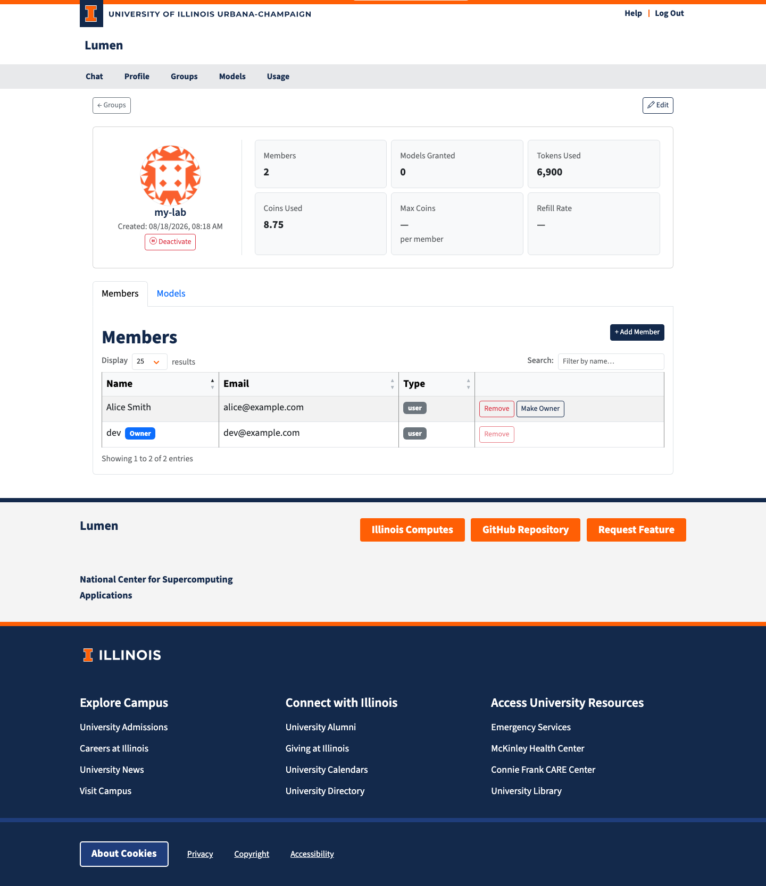

# Group Management

The group detail page (`/groups/<id>`) is where a group's owner manages its members and the models it grants.

## Header Card

The card at the top of the page shows:

| Field | Description |
|-------|------------|
| **Members** | Number of users and projects in the group |
| **Models Granted** | Number of owned models the group opens up |
| **Tokens Used** | Combined input + output tokens across members |
| **Coins Used** | Combined coins spent by members |
| **Max Coins** | The coin ceiling each member inherits (Unlimited, a number, or — for no group pool) |
| **Refill Rate** | Coins added per hour under the group policy |

The owner and admins also get **Deactivate** / **Activate** here, and an **Edit** button in the top-right that opens a dialog for the group's name, description, and active flag. Admins can additionally set Max Coins and the Refill Rate; clearing Max Coins removes the group's coin pool entirely.

## Members

> **Groups with no owner:** if the group has no owner, the Members tab is hidden
> and the Members / Tokens Used / Coins Used cards show a dash — for everyone
> except administrators. Assign an owner to make them visible again. See
> [Groups Overview](groups.md) for the reasoning.

The **Members** tab lists every user and project in the group, with the date each member joined (a dash for memberships older than this feature). The table is sortable by name, email, type, or join date, and paginated — use the Display selector and the search box for large groups.

- The owner carries an **Owner** badge.
- In an **auto-join group**, membership is entirely rule-driven: there is no owner, and nobody — not even an administrator — adds or removes members by hand. Change the rules instead; the change takes effect at each member's next sign-in.

### Adding a Member

1. Click **+ Add Member**.
2. Type at least two characters of a name to search. Both users and projects are offered; each result shows its type.
3. Pick a result from the list, then click **Add Member**.

### Removing a Member

Click **Remove** on their row and confirm. The owner cannot be removed — transfer ownership first.

### Transferring Ownership

Click **Change Owner** (next to **+ Add Member**), search for the new owner by name or email, pick them from the list, and confirm. Only existing **members** of the group are offered — ownership is a promotion, not an invitation — and only users qualify (projects cannot own a group). The previous owner stays in the group as a regular member; their **Remove** button is disabled until ownership has moved. If you transfer your own group away, you lose the ability to manage it.

## Models

The **Models** tab lists the models this group grants access to, with each model's owner.

### Adding a Model

You can only grant models **you own**. If you own no models — or have already granted all of them to this group — the **+ Add Model** button is disabled and explains why on hover.

1. Click **+ Add Model**.
2. Pick a model from the list.
3. Click **Add Model**.

Every member of the group can now use that model. Administrators may grant any owned model, not only their own.

### Removing a Model

Click the trash icon on the model's row and confirm. Members lose access to the model unless another group or their own ownership still grants it.

## Rules (Admin Only)

The **Rules** tab defines the group's auto-join behavior. Administrators only — rules add members based on identity-provider claims, so they are organization policy.

1. Toggle **Auto-join enabled**.
2. Add one rule per condition: a userinfo **field** (e.g. `affiliation`, `idp`), a match type (**contains** for substring, **equals** for exact), and a **value**.
3. Click **Save Rules**.

A user is added at sign-in only when **all** rules match, and is removed again at a later sign-in that no longer matches. Auto-join cannot be saved without at least one rule, and cannot be enabled on a group that has an owner or manually added members — an auto-join group is fully automatic. Turning auto-join off keeps the rules stored but inactive and converts the group back to manual management (an owner can then be assigned and members added by hand).

When creating a group, administrators can check **Auto-join** in the New Group dialog and define the rules right there.

## Who Can Do What

| Action | Admin | Owner | Member |
|--------|:-----:|:-----:|:------:|
| View the group | ✓ | ✓ | ✓ |
| See members and usage of an **ownerless** group | ✓ | — | — |
| Edit name, description, active | ✓ | ✓ | — |
| Set Max Coins / Refill Rate | ✓ | — | — |
| Add and remove members (manual groups) | ✓ | ✓ | — |
| Add and remove members (auto-join groups) | — | — | — |
| Transfer ownership | ✓ | ✓ | — |
| Grant and revoke models | ✓ | ✓ | — |
| Edit auto-join rules | ✓ | — | — |
| Deactivate the group | ✓ | ✓ | — |
