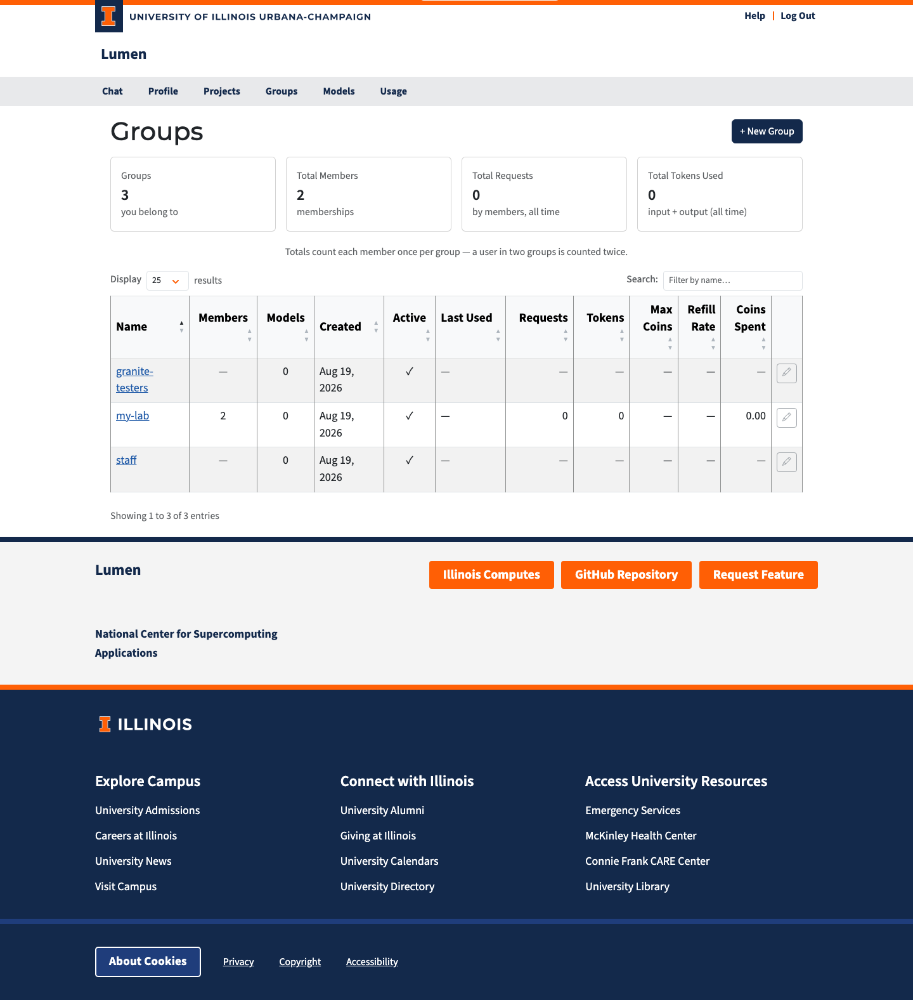

# Groups

The **Groups** page (`/groups`) is where you manage groups — named collections of users and projects that share a coin budget policy and access to owned models.

## What Is a Group?

A **group** bundles members together so that policy can be applied once instead of per person:

- **Coin policy.** A group can carry a coin budget (Max Coins and a Refill Rate). Every member inherits it unless they have a budget of their own. The group does not hold a shared balance — each member gets their own balance governed by the group's policy.
- **Model access.** A model with an owner is private to that owner. Granting it to a group opens it to every member of the group. This is how you share a model you own with a team.

Members can be **users** or **projects**. A project is its own identity for API traffic, so a project member inherits the group's models and coin policy for requests made with the project's API keys.

## Who Can See What

| Role | Visibility |
|------|-----------|
| **Admin** | All groups in the system, including members and usage for every group |
| **Member** | Only groups they belong to |

Anyone signed in can create a group, so the Groups page is always available.

### Groups with no owner

A group with no owner has nobody accountable for its membership — typically one
created automatically by a `group_rules` entry in `config.yaml`. For those groups
the **member list and all usage totals are hidden from everyone except
administrators**, and they are left out of the summary cards. Members, Requests,
Tokens and Coins Spent show a dash. This stops a large auto-assigned group from
becoming a way for any member to browse the whole user directory.

Everything that affects you as a member stays visible: the group's name, whether
it is active, its coin policy, and the models it grants you. Assigning an owner
makes the hidden columns visible to members again.

## Summary Cards

| Card | Description |
|------|-------------|
| **Groups** | Number of groups visible to you |
| **Total Members** | Combined memberships across those groups |
| **Total Requests** | Combined API requests made by members |
| **Total Tokens Used** | Combined input + output tokens |

Usage is summed over each group's members. A member who belongs to two groups counts toward both — these are per-group views of member activity, not a split of overall traffic.

## Group Table

| Column | Description |
|--------|------------|
| **Name** | Clickable link to the group detail page |
| **Members** | Number of users and projects in the group |
| **Models** | Number of owned models granted to the group |
| **Created** | When the group was created |
| **Active** | Green checkmark for active, red X for deactivated |
| **Last Used** | When a member last made a request |
| **Requests** | Total API requests by members |
| **Tokens** | Total input + output tokens by members |
| **Max Coins** | The group's coin ceiling per member (∞ = unlimited, — = no group pool) |
| **Refill Rate** | Coins added per hour under the group policy |
| **Coins Spent** | Total coins spent by members |

Click any column header to sort. Use the search box to filter by name.

Each row has an edit (pencil) button and an activate/deactivate button, enabled for the group's owner and for admins. Other members see the pencil disabled with a note explaining why.

### Auto-join groups

A group can **auto-join** members: administrators define rules on the group's Rules tab (or when creating the group), and anyone whose login claims match *all* of the rules is added at sign-in — and removed again when they stop matching. An auto-join group is *fully* automatic: it has no owner, and members cannot be added or removed by hand — the rules alone decide membership. See [Group Management](groups-detail.md) for details.

## Creating a Group

Anyone can create a group:

1. Click **+ New Group**.
2. Enter a name, and optionally a description.
3. Click **Create**.

You become the owner of the group and are redirected to its detail page.

Administrators see extra fields in the dialog: an **Owner** search box (leave it blank for a group with no owner) and **Max Coins** / **Refill Rate** for the group's coin policy. Non-admins cannot set an owner or a coin policy — an admin has to add the coin policy afterwards.
