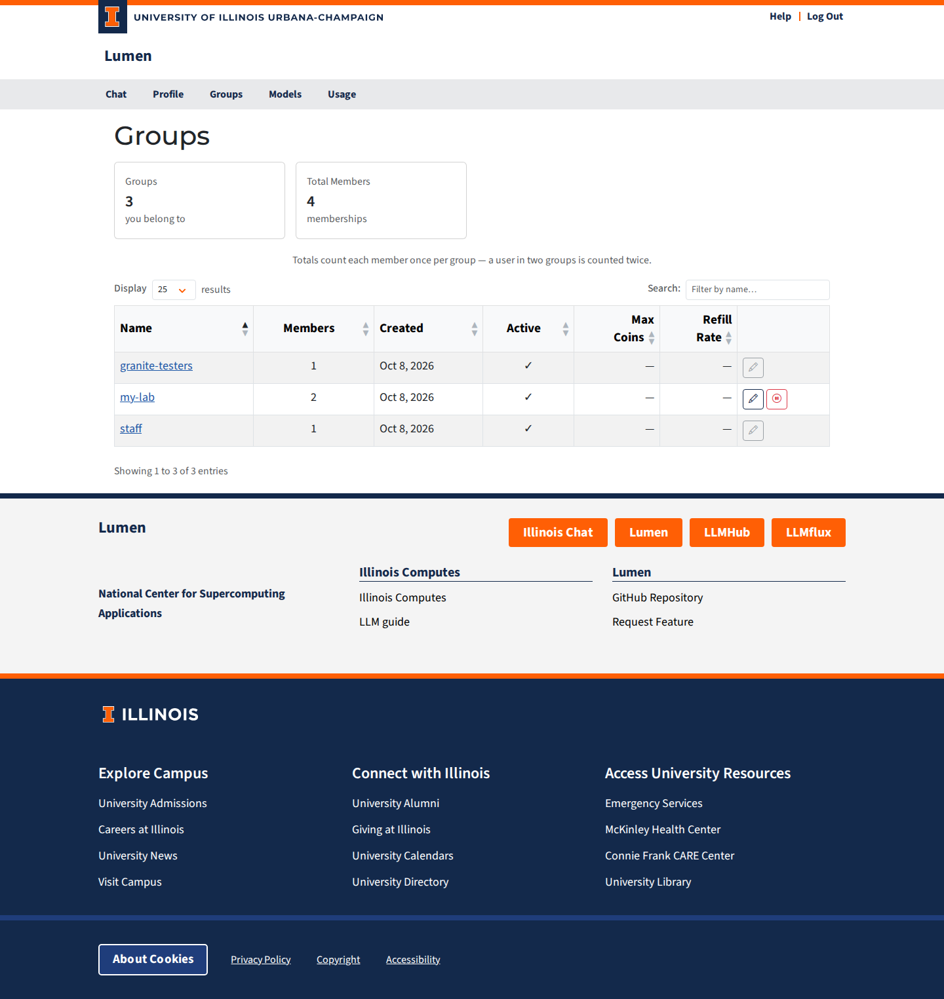

# Groups

The **Groups** page (`/groups`) is where you manage groups — named collections of users and projects that share a coin budget policy.

## What Is a Group?

A **group** bundles members together so that policy can be applied once instead of per person:

- **Coin policy.** A group can carry a coin budget (Max Coins and a Refill Rate). Every member inherits it unless they have a budget of their own. The group does not hold a shared balance — each member gets their own balance governed by the group's policy.
- **Model access.** Groups do not grant model access; a group carries only a coin policy.

Groups are primarily used to set up coin distribution. In practice there are two kinds:

- **Auto-join groups** that you are placed in automatically when you log in, based on your login claims (for example your affiliation). These give everyone from the same place the same coin policy.
- **Groups created by administrators** to raise the coin limits of specific users, for example a research team that needs more usage than the default.

Members can be **users** or **projects**. A project is its own identity for API traffic, so a project member inherits the group's coin policy for requests made with the project's API keys.

## Who Can See What

| Role | Visibility |
|------|-----------|
| **Admin** | All groups in the system, including members for every group |
| **Member** | Only groups they belong to |

The Groups page is always available to signed-in users, but only administrators (in admin mode) can create groups.

### Groups with no owner

A group with no owner has nobody accountable for its membership — typically a
large auto-join group populated by login rules. For those groups the **member
list is hidden from everyone except administrators**. This stops a large
auto-assigned group from becoming a way for any member to browse the whole user
directory.

Everything that affects you as a member stays visible: the group's name, whether
it is active, how many members it has, and its coin policy. Assigning an owner
makes the member list visible to members again.

## Summary Cards

| Card | Description |
|------|-------------|
| **Groups** | Number of groups visible to you |
| **Total Members** | Combined memberships across those groups |

A member who belongs to two groups counts toward both.

## Group Table

| Column | Description |
|--------|------------|
| **Name** | Clickable link to the group detail page |
| **Members** | Number of users and projects in the group |
| **Created** | When the group was created |
| **Active** | Green checkmark for active, red X for deactivated |
| **Max Coins** | The group's coin ceiling per member (∞ = unlimited, — = no group pool) |
| **Refill Rate** | Coins added per hour under the group policy |

Click any column header to sort. Use the search box to filter by name.

Each row has an edit (pencil) button and an activate/deactivate button, enabled for the group's owner and for admins. Other members see the pencil disabled with a note explaining why.

### Auto-join groups

A group can **auto-join** members: administrators define rules on the group's Rules tab (or when creating the group), and anyone whose login claims match *all* of the rules is added at sign-in — and removed again when they stop matching. An auto-join group is *fully* automatic: it has no owner, and members cannot be added or removed by hand — the rules alone decide membership. See [Group Management](groups-detail.md) for details.

## Creating a Group

Only administrators with admin mode enabled can create groups; the **+ New Group** button is hidden for everyone else.

1. Click **+ New Group**.
2. Enter a name, and optionally a description.
3. Optionally pick an **Owner** (leave it blank for a group with no owner) and set **Max Coins** / **Refill Rate** for the group's coin policy.
4. Click **Create**.

You are redirected to the new group's detail page.
