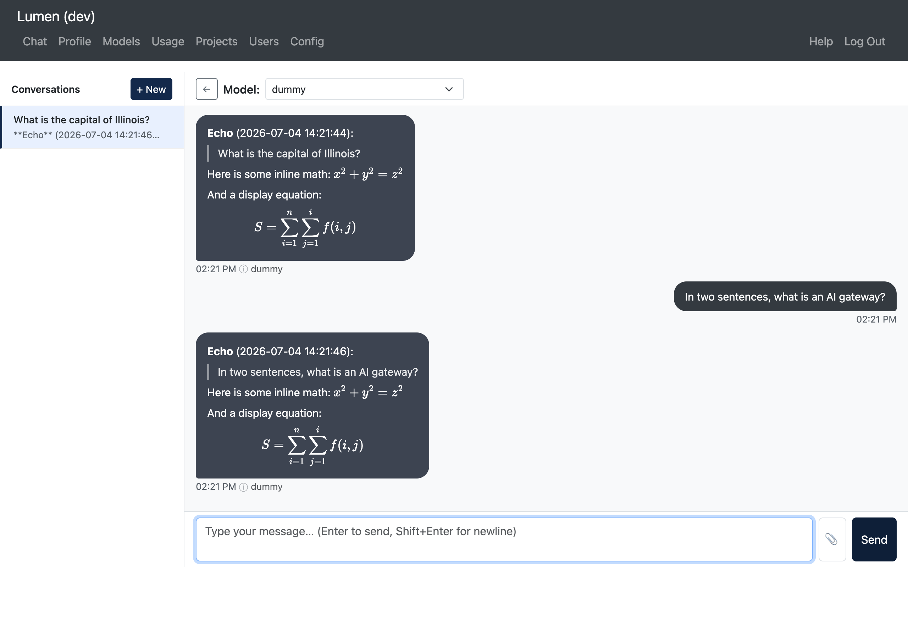

# Chat

The **Chat** page (`/chat`) is the main interface for interacting with AI models.

## Page Layout

- **Left sidebar** — Lists your conversations. Click any conversation to reload its message history.
- **Model selector** — At the top of the chat area. Choose which model to send your message to. Graylisted models show a warning (⚠) if you haven't acknowledged them yet.
- **Chat area** — Displays message bubbles. Your messages appear on the right; assistant replies appear on the left.
- **Message detail** — Each assistant message has an info icon (ⓘ). Click it to see the token counts, response duration, and output speed for that reply.

## Conversation Management

- **New conversation** — Click the **+ New** button in the sidebar.
- **Switch conversations** — Click any conversation in the sidebar to load its history.
- **Remove conversation** — Hover over a conversation and click the ✕ button.
- **Conversation title** — Automatically generated from your first message.

## Sending Messages

1. Select a model from the dropdown at the top.
2. Type your message in the input area at the bottom.
3. Press **Enter** to send. Hold **Shift+Enter** to insert a newline without sending.

## Streaming and Thinking

Responses stream in character by character as the model generates them. For models that support reasoning, a collapsible **Thinking…** section appears above the final answer, showing the model's chain-of-thought.

## File Attachments

Attach a file to your message in two ways:

- **File picker** — Click the paperclip (📎) button.
- **Drag and drop** — Drag a file directly onto the message input bar.

Supported file types:

| Type | Extensions |
|------|-----------|
| Documents | `.txt`, `.md`, `.csv`, `.json`, `.py`, `.js`, `.ts`, `.html`, `.css`, `.xml`, `.yaml`, `.yml` |
| PDFs | `.pdf` |
| Images | `.png`, `.jpg`, `.jpeg`, `.gif`, `.webp` |

- **Images** are sent as part of a multimodal message (useful for vision-capable models).
- **Documents** are read and prepended to your message text.
- **PDFs** are parsed and appended as text.

An attachment chip appears above the input while composing. Click ✕ on the chip to remove it before sending.

## Markdown and Math

Assistant responses are rendered with full formatting support:

- **Markdown** — Headers, code blocks, lists, links, tables, and more.
- **Math** — Inline `$…$` and display `$$…$$` LaTeX expressions rendered with KaTeX.
- **Code blocks** — Dollar signs inside fenced code blocks are preserved and not treated as math.

## Sidebar Toggle

On desktop, click the ←/→ arrow button in the header to collapse or expand the conversation sidebar. On mobile, the sidebar opens as an overlay via the hamburger menu.
