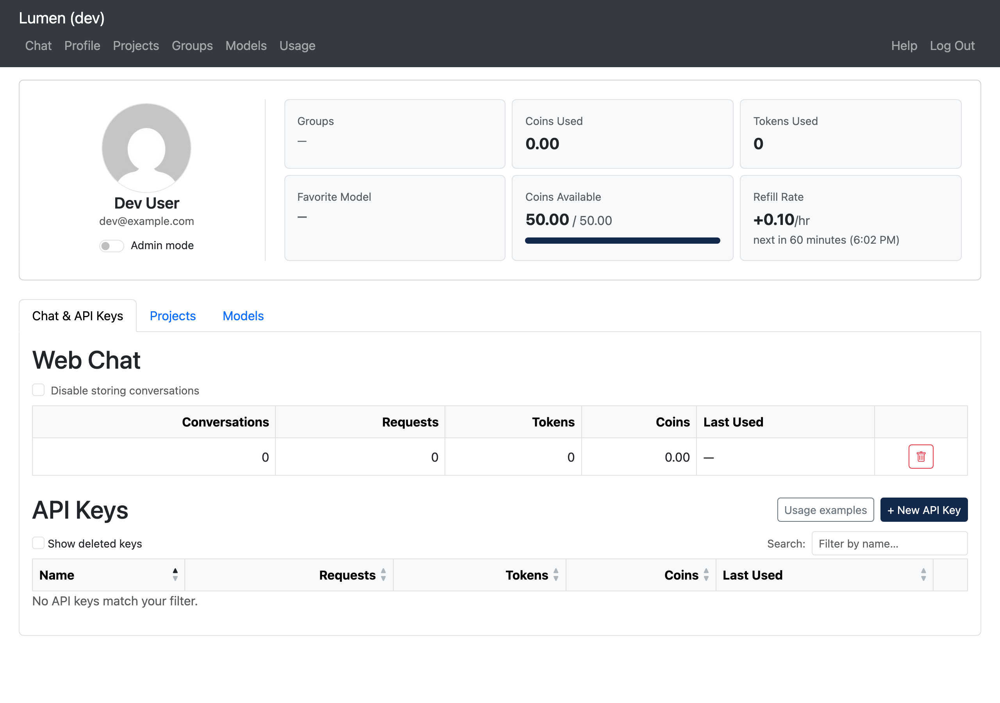

# Profile & API Keys

The **Profile** page (`/profile`) shows your coin balance, spending history, model access, and your personal API keys. Below the profile card, the page is organized into tabs: **Chat & API Keys** (web chat settings and your API keys), **Projects** (only shown if you can access any projects), and **Models** (your model access). The selected tab is reflected in the URL (`/profile#chat`, `/profile#projects`, `/profile#models`), so you can bookmark or share a link to a specific tab.

## Profile Card

At the top of the page, a card shows your identity and a summary of your account activity.

The left side displays your avatar (pulled from [Gravatar](https://gravatar.com) based on your email), your display name, and email address.

### Admin Mode

If your account is listed as an administrator, an **Admin mode** switch appears under your email address. Administrators act as normal users by default: admin pages and navigation links (Users, Config, all projects) are hidden until you turn the switch on, and turning it off returns you to normal-user permissions. The setting lasts only for your current session — logging out (or being logged out) always resets you to normal-user mode.

The right side shows six stat tiles:

| Tile | Description |
|------|------------|
| **Groups** | The groups you belong to |
| **Coins Used** | Total coins spent across all models, all time |
| **Tokens Used** | All input + output tokens across all models, all time |
| **Favorite Model** | The model you have used most |
| **Coins Available** | Your current pool balance with a progress bar (when a limit is set) |
| **Refill Rate** | Auto-refill rate per hour and a countdown to the next refill |

### Editing a User (admins)

Admins in admin mode see an **Edit** button above the stat tiles — on their own profile and when viewing another user's profile from the admin Users page. It opens a dialog to enable/disable the account (**Active**) and set the user's coin pool: **Max Coins** (`-2` = unlimited, `0` = blocked) and **Refill Rate** (coins added per hour). Clearing Max Coins removes the user's own pool so it falls back to their groups or the global defaults; lowering Max Coins clamps the current balance. A user's name cannot be edited here — it comes from the login provider.

### Coin Pool Values

| Value | Meaning |
|-------|---------|
| A positive number | Coins remaining in your budget |
| **Unlimited** | No cap — you can always send requests |
| **—** | No budget has been set up for your account |
| 0 or negative | Budget exhausted; further requests are blocked until a refill or an admin grants more coins |

## Web Chat Usage

In the **Chat & API Keys** tab, a row summarizes your web chat activity:

| Column | Description |
|--------|------------|
| **Conversations** | Number of conversations you have started, all time — kept even if you delete conversations or disable storage |
| **Requests** | Total messages sent through the chat interface |
| **Tokens** | Total input + output tokens via web chat |
| **Coins** | Total coins spent on web chat |
| **Last Used** | When you most recently sent a message |

### Deleting All Conversations

Click the trash icon in the web chat table to permanently remove every conversation (and all of its messages) from your account. A confirmation dialog opens first — the deletion cannot be undone. Usage statistics (conversation count, requests, tokens, coins) are kept.

### Disabling Conversation Storage

Check **Disable storing conversations** above the web chat table if you do not want Lumen to keep a record of your web chats. Because disabling storage also deletes everything already stored, a confirmation dialog explains this before the switch takes effect; canceling the dialog leaves storage on.

While storage is disabled:

- Chat works normally — you can still hold multi-turn conversations.
- Nothing is saved: no conversations appear in the chat sidebar, and the sidebar shows a notice with a link back to this setting.
- Usage statistics, including the conversation count, are still recorded.

Turn the switch off at any time to resume storing new conversations. Previously deleted conversations cannot be recovered.

## API Keys

API keys let you access Lumen's AI models from your own code, scripts, or compatible tools — without opening a browser. They are listed in the **Chat & API Keys** tab.

### What an API Key Is

An API key is a secret token in the format `sk_...`. It identifies you to the API the same way your login session identifies you in the browser. Each key has its own usage counters, so you can track exactly how much each integration is using.

> **Important:** The key is shown **only once** when you create it. Copy it immediately — it cannot be retrieved later.

### Creating a Key

1. Click **+ New API Key** at the top of the API Keys section.
2. A dialog opens and displays your new key in a read-only field.
3. **Copy the key now.**
4. Enter a descriptive name (e.g., `my-research-script` or `jupyter-notebook`).
5. Click **Save Key**. The key now appears in the table.

### Viewing Your Keys

The API Keys table shows all your active keys and lets you sort by name, requests, tokens, cost, or last used. Enable **Show deleted keys** to see previously revoked keys (displayed with strikethrough).

| Column | Description |
|--------|------------|
| **Name** | The label you chose |
| **Hint** | First 4 + last 4 characters of the key, for identification |
| **Requests** | Total API calls made with this key |
| **Tokens** | Total input + output tokens |
| **Coins** | Total coins spent |
| **Last Used** | Timestamp of the last API call |
| **Actions** | Revoke button for active keys |

### Revoking a Key

Click **Delete** on any active key. The key is deactivated immediately — any code using it will start receiving authentication errors. Usage history is preserved and visible with "Show deleted keys".

## Projects

If you can access any projects, a **Projects** tab lists them with their usage (requests, tokens, coins) and creation date. Each name links to the project's detail page — see the [Projects](../projects/projects.md) documentation.

## Model Access

The **Models** tab lists models available to you, including models that still need your acknowledgment. Models owned by someone else without a grant to one of your active groups are blocked and omitted completely. Disabled, expired, and deleted models are also omitted, even when you have historical usage for them.

| Column | Description |
|--------|------------|
| **Model** | Clickable link to the model detail page |
| **Requests / Tokens / Coins / Last Used** | Your personal usage stats for that model |
| **Access** | Your current access level (see below) |
| **Status** | Health of the model's backend |

### Access Levels

| Badge | Meaning |
|-------|---------|
| **Need Consent** (warning) | Model requires a one-time acknowledgment — click to enable it |
| **Consented** (green) | You have acknowledged this model and can use it |
| **Allowed** (green) | Model is fully available to you |

### Model Status

| Badge | Meaning |
|-------|---------|
| **ok** (green) | All backends healthy |
| **degraded** (yellow) | Some backends are down but at least one is working |
| **down** (red) | No healthy backends |

Click any column header to sort the table. Use the search box to filter by model name.
