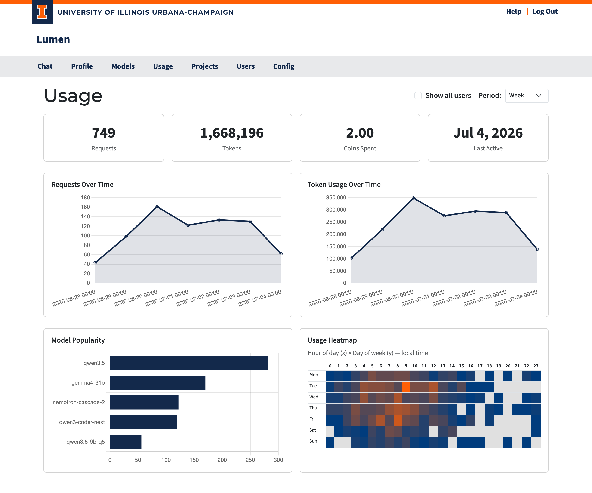

# Usage & API Keys

The **Usage** page (`/usage`) shows your coin balance, spending history, model access, and your personal API keys.

## Status Cards

At the top of the page, four cards summarize your account:

| Card | Description |
|------|------------|
| **Total Tokens Used** | All input + output tokens across all models, all time |
| **Coins Spent** | Total coins spent across all models, all time |
| **Coins Available** | Your current pool balance with a progress bar (when a limit is set) |
| **Coin Refill** | Auto-refill rate per hour and a countdown to the next refill |

### Coin Pool Values

| Value | Meaning |
|-------|---------|
| A positive number | Coins remaining in your budget |
| **Unlimited** | No cap — you can always send requests |
| **Not configured** | No budget has been set up for your account |
| 0 or negative | Budget exhausted; further requests are blocked until a refill or an admin grants more coins |

## Web Chat Usage

Below the stat cards, a row summarizes your web chat activity:

| Column | Description |
|--------|------------|
| **Conversations** | Number of conversations you have started |
| **Requests** | Total messages sent through the chat interface |
| **Tokens** | Total input + output tokens via web chat |
| **Coins** | Total coins spent on web chat |
| **Last Used** | When you most recently sent a message |

## API Keys

API keys let you access Lumen's AI models from your own code, scripts, or compatible tools — without opening a browser.

### What an API Key Is

An API key is a secret token in the format `sk_...`. It identifies you to the API the same way your login session identifies you in the browser. Each key has its own usage counters, so you can track exactly how much each integration is using.

> **Important:** The key is shown **only once** when you create it. Copy it immediately — it cannot be retrieved later.

### Creating a Key

1. Click **+ New API Key** at the top of the API Keys section.
2. A dialog opens and displays your new key in a read-only field.
3. **Copy the key now.**
4. Enter a descriptive name (e.g., `my-research-script` or `jupyter-notebook`).
5. Click **Save Key**. The key now appears in the table.

### Viewing Your Keys

The API Keys table shows all your active keys and lets you sort by name, requests, tokens, cost, or last used. Enable **Show deleted keys** to see previously revoked keys (displayed with strikethrough).

| Column | Description |
|--------|------------|
| **Name** | The label you chose |
| **Hint** | First 4 + last 4 characters of the key, for identification |
| **Requests** | Total API calls made with this key |
| **Tokens** | Total input + output tokens |
| **Coins** | Total coins spent |
| **Last Used** | Timestamp of the last API call |
| **Actions** | Revoke button for active keys |

### Revoking a Key

Click **Delete** on any active key. The key is deactivated immediately — any code using it will start receiving authentication errors. Usage history is preserved and visible with "Show deleted keys".

## Model Access

The Model Access table lists every model available in Lumen and your access status for each.

| Column | Description |
|--------|------------|
| **Model** | Clickable link to the model detail page |
| **Requests / Tokens / Coins / Last Used** | Your personal usage stats for that model |
| **Access** | Your current access level (see below) |
| **Status** | Health of the model's backend |

### Access Levels

| Badge | Meaning |
|-------|---------|
| **Need Consent** (warning) | Model requires a one-time acknowledgment — click to enable it |
| **Consented** (green) | You have acknowledged this model and can use it |
| **Allowed** (green) | Model is fully available to you |
| **Blocked** (red) | Model is not available to you |

### Model Status

| Badge | Meaning |
|-------|---------|
| **ok** (green) | All backends healthy |
| **degraded** (yellow) | Some backends are down but at least one is working |
| **down** (red) | No healthy backends |
| **disabled** (gray) | Model is currently turned off |

Click any column header to sort the table. Use the search box to filter by model name. Check **Show disabled** to include currently disabled models.
