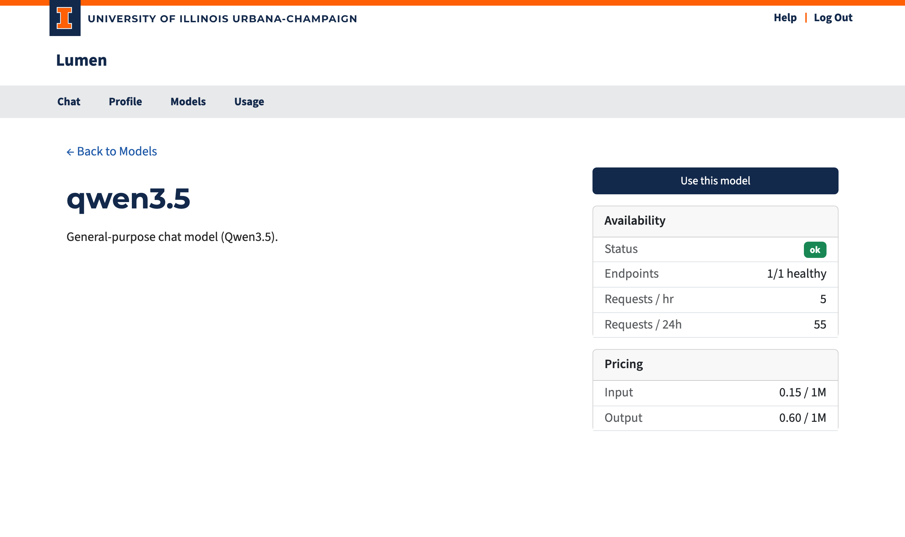

# Model Detail

The model detail page (`/models/<name>`) shows everything you need to know about a specific model before you use it.

## Page Layout

The page is split into two columns.

### Left Column

- **Model name** with a link to the model's HuggingFace page (when available).
- **Description** — A short summary of the model.
- **README** — The model's full documentation, rendered from its HuggingFace repository.

### Right Column

#### Access Status

This card appears when the model requires acknowledgment before use:

| State | What You See |
|-------|-------------|
| **Not yet acknowledged** | A warning card with an "Acknowledge & Enable Access" button |
| **Already acknowledged** | A confirmation with the date you accepted |
| **Blocked** | A notice that this model is not available to you |

Click the button to give one-time consent. After acknowledging, the model is immediately available in the chat interface and API.

#### Availability

| Field | Description |
|-------|-------------|
| **Status** | Overall health: ok / degraded / down |
| **Endpoints** | Healthy backend count vs. total |
| **Requests / hr** | Requests sent to this model in the last hour |
| **Requests / 24h** | Requests sent to this model in the last 24 hours |

#### Model Specifications

Technical details that help you decide if this model fits your task:

| Field | Description |
|-------|-------------|
| **Context Window** | How much text the model can "remember" in one conversation (roughly the input plus output combined) |
| **Max Output** | Maximum tokens the model can generate in a single reply |
| **Input** | What input types the model accepts — e.g., text, images |
| **Output** | What the model produces — typically text |
| **Knowledge Cutoff** | The date beyond which the model has no training data |
| **Reasoning** | Checkmark if the model can show its step-by-step thinking before giving an answer |
| **Function Calling** | Checkmark if the model can request to run a tool (such as a search script or data query) on the user's computer via the API — not available in Lumen's built-in chat. The user explicitly agrees to each request; the model cannot access data without their consent. |

#### Pricing

Shows the coin cost per million input tokens and per million output tokens. See the [Introduction](../introduction.md#tokens-and-coins) for how coin costs are calculated.
