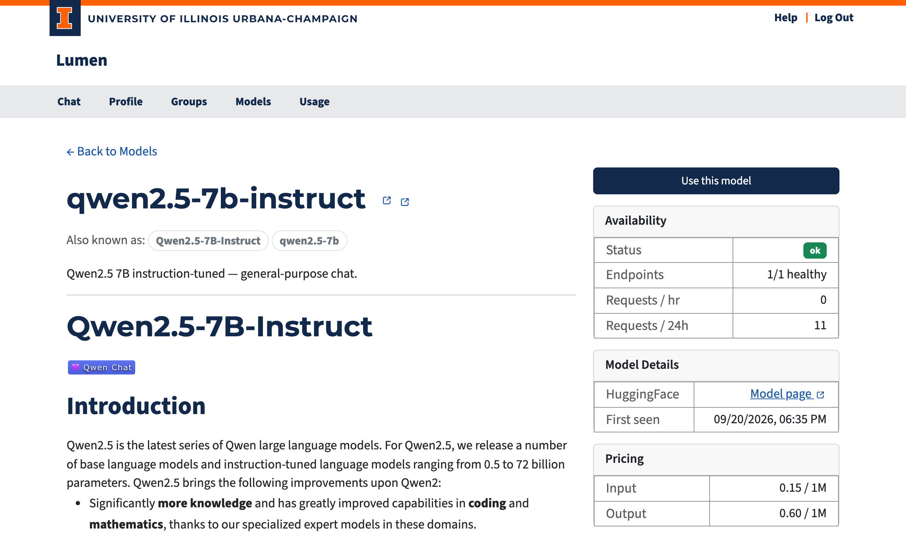
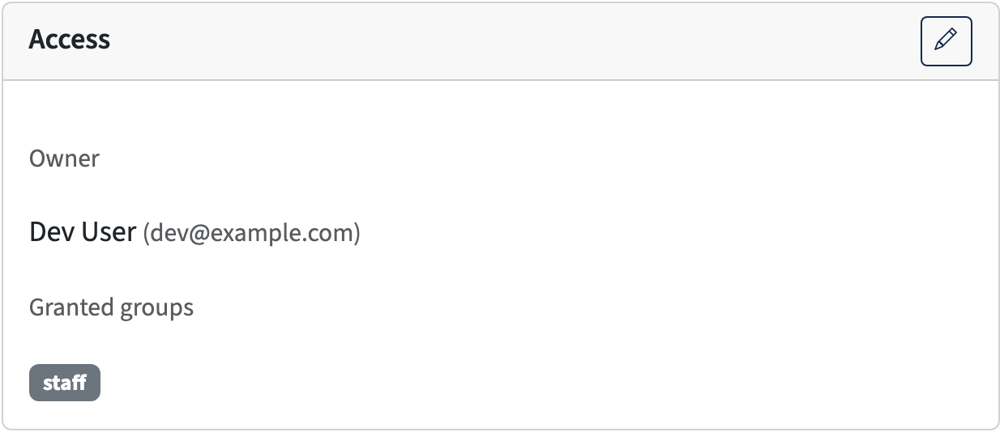

# Model Detail

The model detail page (`/models/<name>`) shows everything you need to know about a specific model before you use it.

## Page Layout

The page is split into two columns.

### Left Column

- **Model name** with a link to the model's HuggingFace page (when available). Early-access models show an **early access** badge next to the name.
- **Description** — A short summary of the model.
- **README** — The model's full documentation, rendered from its HuggingFace repository.

### Right Column

#### Access Status

This card appears when the model requires acknowledgment before use:

| State | What You See |
|-------|-------------|
| **Not yet acknowledged** | A warning card with an "Acknowledge & Enable Access" button |
| **Already acknowledged** | A confirmation with the date you accepted |
| **Blocked** | A notice that this model is not available to you |

Click the button to give one-time consent. The dialog lists everything that applies: the model's notice (when it requires acknowledgment) and an early-access warning (when the model is an early-access preview that may change or be removed). One click acknowledges all of it. After acknowledging, the model is immediately available in the chat interface and API. If the model later gains a new requirement — for example it becomes early access — you are asked to acknowledge once more.

#### Access (Admin Only)

Administrators see an **Access** card showing who may use the model: either **Public** (available to everyone) or the model's **owner** and the groups it has been granted to. A model with no owner is available to all users and projects; an owned model is available only to its owner and to members of the granted groups.

The pencil button opens the **Edit Access** dialog:

- **Owner** — a typeahead field that searches users by name or email; pick a user to make them the owner.
- **Make public** — clears the owner (and grants become irrelevant), making the model available to everyone.
- **Groups** — checkboxes selecting which groups are granted access to the owned model.

Ownership and grants are stored in the database and are not part of `config.yaml` — see [Configuring Models](../admin/config-models.md#access-control).

#### Availability

| Field | Description |
|-------|-------------|
| **Status** | Overall health: ok / degraded / down |
| **Endpoints** | Healthy backend count vs. total |
| **Available until** | Shown when the model has an end date; the model can no longer be used after this time |
| **Requests / hr** | Requests sent to this model in the last hour |
| **Requests / 24h** | Requests sent to this model in the last 24 hours |

#### Model Specifications

Technical details that help you decide if this model fits your task:

| Field | Description |
|-------|-------------|
| **Context Window** | How much text the model can "remember" in one conversation (roughly the input plus output combined) |
| **Max Output** | Maximum tokens the model can generate in a single reply |
| **Input** | What input types the model accepts — e.g., text, images |
| **Output** | What the model produces — typically text |
| **Knowledge Cutoff** | The date beyond which the model has no training data |
| **Reasoning** | Checkmark if the model can show its step-by-step thinking before giving an answer |
| **Function Calling** | Checkmark if the model can request to run a tool (such as a search script or data query) on the user's computer via the API — not available in Lumen's built-in chat. The user explicitly agrees to each request; the model cannot access data without their consent. |
| **First seen** | When the model was added to this Lumen instance |

#### Pricing

Shows the coin cost per million input tokens and per million output tokens. See the [Introduction](../introduction.md#tokens-and-coins) for how coin costs are calculated.
