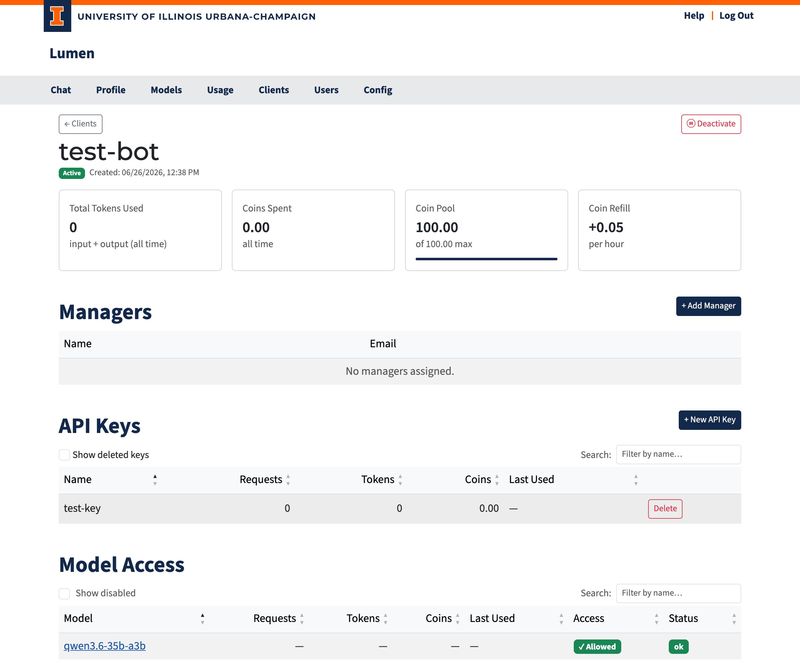

# Project Detail

This page is for people managing Lumen-based services and tools. For details on what a project is, start with the [Projects overview](./projects.md).

The project detail page (`/projects/<id>`) is where you manage a specific project: view usage, assign managers, create API keys, and check model access.



## Usage Cards

The top row shows the project's activity and budget:

| Card | Description |
|------|-------------|
| **Total Tokens Used** | All input + output tokens this project has consumed |
| **Coins Spent** | Total coins spent by this project |
| **Coin Pool** | Current balance (or **Unlimited** / **Not configured**) |
| **Coin Refill** | Auto-refill rate and countdown to next refill |

## Managers

Managers are the users responsible for a project. They can create and revoke API keys, grant model consent, and view usage — but they cannot manage other managers or deactivate the project.

### Adding a Manager (admin only)

1. Click **+ Add Manager**.
2. A search dialog opens. Start typing a user's name or email.
3. Select the user from the dropdown.
4. Click **Add Manager**.

### Removing a Manager (admin only)

Click **Remove** next to any manager in the table.

### What Managers Can Do

| Action | Manager | Admin |
|--------|---------|-------|
| Create API keys for this project | ✓ | ✓ |
| Revoke API keys for this project | ✓ | ✓ |
| Grant model consent for this project | ✓ | ✓ |
| View usage on this page | ✓ | ✓ |
| Add / remove managers | — | ✓ |
| Activate / deactivate the project | — | ✓ |

## API Keys

This section works exactly like the API Keys section on the [Profile page](../guides/profile.md#api-keys), but keys here belong to the project, not to your personal account.

### Creating a Key

1. Click **+ New API Key**.
2. The key is generated and shown **once** in a dialog — copy it immediately.
3. Give the key a descriptive name (e.g., `production`, `staging`, `ci-runner`).
4. Click **Save Key**.

Keys follow the same `sk_...` format as personal API keys. Use them exactly the same way in code:

```python
from openai import OpenAI

project = OpenAI(
    api_key="sk_project_key_here",
    base_url="https://your-lumen-instance/v1"
)

response = project.chat.completions.create(
    model="gpt-4o",
    messages=[{"role": "user", "content": "Summarize this dataset: ..."}]
)
```

### Key Table

| Column | Description |
|--------|-------------|
| **Name** | Label you chose |
| **Hint** | First 4 + last 4 characters for identification |
| **Requests / Tokens / Coins** | Usage tracked on this key |
| **Last Used** | Timestamp of the last API call |
| **Actions** | Revoke button for active keys |

Use **Show deleted keys** to view previously revoked keys. Use the search box to filter.

## Model Access

This table shows which models this project can use and how much it has consumed on each. The columns and access badges are the same as on the [Profile page](../guides/profile.md#model-access).

If a model shows **Needs Consent**, you can click it to grant acknowledgment on behalf of the project, making the model available to all API keys associated with this project.
