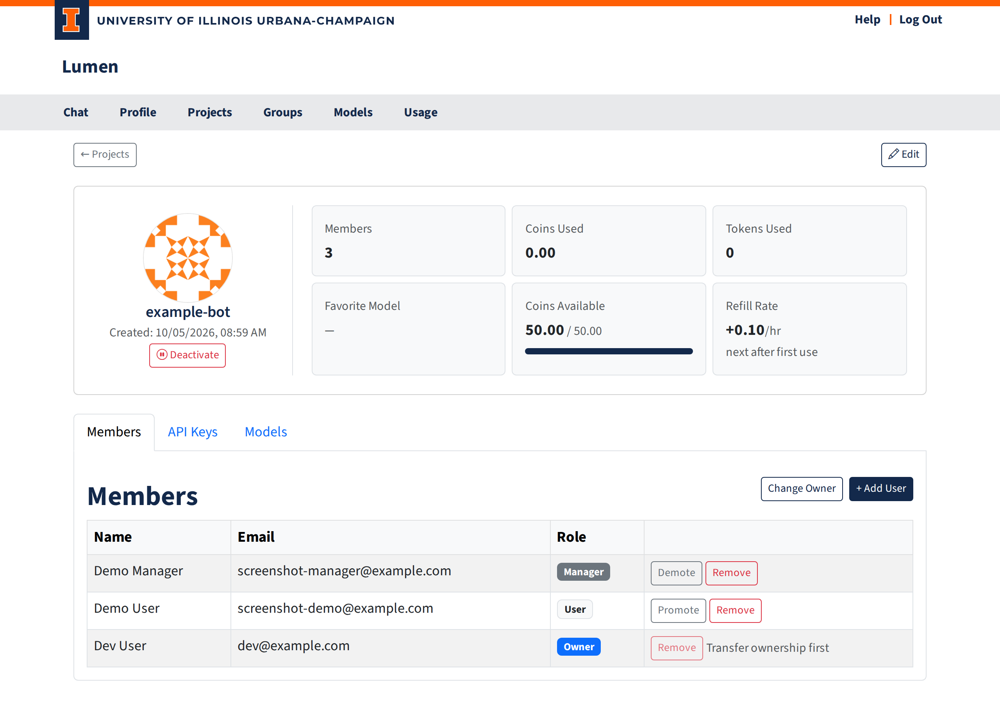

# Project Detail

This page is for people managing Lumen-based services and tools. For details on what a project is, start with the [Projects overview](./projects.md).

The project detail page (`/projects/<id>`) is where you manage a specific project: view usage, add members, create API keys, and check model access. It is laid out like the [Profile page](../guides/profile.md): a header card at the top, followed by **Members**, **API Keys**, and **Models** tabs.



## Header Card

The left side of the card shows the project's auto-generated avatar, its name, the creation date, and — for the owner or an admin — the **Deactivate**/**Activate** button. The right side shows the project's activity and budget:

| Card | Description |
|------|-------------|
| **Members** | Number of members listed on the Members tab (a user sees a smaller count; see below) |
| **Coins Used** | Total coins spent by this project |
| **Tokens Used** | All input + output tokens this project has consumed |
| **Favorite Model** | The model this project has sent the most requests to |
| **Coins Available** | Current balance (or **Unlimited** / not configured) |
| **Refill Rate** | Auto-refill rate and countdown to next refill |

### Editing the Project

The owner and admins see an **Edit** button above the stat cards. It opens a dialog where the owner or an admin can change the project's **name** and **Active** flag. Admins additionally see the project's coin pool: **Max Coins** (`-2` = unlimited, `0` = blocked) and **Refill Rate** (coins added per hour). Clearing Max Coins removes the project's own pool so it falls back to its groups or the global defaults; lowering Max Coins clamps the current balance to the new cap.

## Members

Everyone who can open the project is a member, and every member has one role. The **Role** column shows it as a text badge:

- **Owner**: the one manager the project belongs to. Every project always has exactly one owner.
- **Manager**: can create and delete any of the project's API keys, and add or remove users.
- **User**: can create one API key at a time and sees only the keys they created.

The list shows the owner first, then managers, then users, sorted A–Z by name within each group. A **user** sees only themselves, the owner and the managers, not the other users. Managers, the owner and admins see every member.

### Adding a Member (manager, owner or admin)

1. Click **+ Add User**.
2. A search dialog opens. Start typing a user's name or email.
3. Select the user from the dropdown.
4. Pick a **Role**. Managers can only add users; the **Manager** option appears only for the owner and admins.
5. Click **Add User**.

### Removing a Member

Click **Remove** next to the member. Managers can remove users; only the owner or an admin can remove managers. The owner can't be removed: the owner and admins see the owner's **Remove** button disabled, with the hint "Make another manager owner first". Managers see no button on the owner's row.

### Promoting and Demoting (owner or admin)

Click **Promote** next to a user to make them a manager, or **Demote** next to a manager to make them a user. The owner cannot be demoted.

### Transferring Ownership (owner or admin)

Click **Make Owner** on a manager's row and confirm. The button appears only on **manager** rows, so promote a user first if needed. The previous owner becomes a regular manager. If you are the current owner, transferring ownership means you will no longer be able to add or remove managers or toggle the project.

### What Each Role Can Do

| Action | User | Manager | Owner | Admin |
|--------|------|---------|-------|-------|
| View the project, its usage and model access | ✓ | ✓ | ✓ | ✓ |
| Grant model consent for this project | — | ✓ | ✓ | ✓ |
| Create API keys | One at a time | ✓ | ✓ | ✓ |
| See and delete API keys | Own keys only | All | All | All |
| Rotate API keys: creator only | ✓ | ✓ | ✓ | ✓ |
| Add / remove users | — | ✓ | ✓ | ✓ |
| Add / remove managers, promote / demote | — | — | ✓ | ✓ |
| Transfer ownership | — | — | ✓ | ✓ |
| Activate / deactivate or rename the project | — | — | ✓ | ✓ |
| Change the coin pool (Max Coins / Refill Rate) | — | — | — | ✓ |

## API Keys

This section works exactly like the API Keys section on the [Profile page](../guides/profile.md#api-keys), but keys here belong to the project, not to your personal account.

Managers, the owner and admins see every key in the project. A **user** sees only the keys they created, without the **Created By** column.

### Creating a Key

1. Click **+ New API Key**.
2. The key is generated and shown **once** in a dialog — copy it immediately.
3. Give the key a descriptive name (e.g., `production`, `staging`, `ci-runner`).
4. Click **Save Key**.

If you are a **user** and already have an active key, **+ New API Key** is disabled and the page explains why. Delete your key to create a new one.

Keys follow the same `sk_...` format as personal API keys. Use them exactly the same way in code:

```python
from openai import OpenAI

project = OpenAI(
    api_key="sk_project_key_here",
    base_url="https://lumen.example.com/v1"
)

response = project.chat.completions.create(
    model="gpt-4o",
    messages=[{"role": "user", "content": "Summarize this dataset: ..."}]
)
```

### Key Table

| Column | Description |
|--------|-------------|
| **Name** | Label you chose |
| **Created By** | User who created the key (email if no display name); **Unknown** for keys created before this was tracked, or whose creator was deleted. Not shown to users. |
| **Hint** | First 4 + last 4 characters for identification |
| **Requests / Tokens / Coins** | Usage tracked on this key |
| **Last Used** | Timestamp of the last API call |
| **Actions** | Rotate (keys you created) and Delete buttons for active keys |

Use **Show deleted keys** to view previously revoked keys. Use the search box to filter by key name or creator (by name only for users).

### Rotating a Key

Click **Rotate** to replace a key's secret while keeping its name and usage stats. The button only appears on keys you created; other managers, the owner and admins cannot rotate your keys. The flow is the same as [on the Profile page](../guides/profile.md#rotating-a-key): the current key stops working immediately and the new key is shown once.

## Model Access

This table shows which models this project can use and how much it has consumed on each. Models awaiting acknowledgment remain visible; models blocked for the project and disabled, expired, or deleted models are omitted without exposing their metadata. The columns and access badges are the same as on the [Profile page](../guides/profile.md#model-access).

If a model shows **Needs consent**, the owner or a manager (or an admin) can click it to grant acknowledgment on behalf of the project, making the model available to all API keys associated with this project. Users see **Needs consent: ask a project manager** instead, and need a manager or the owner to acknowledge the model.
