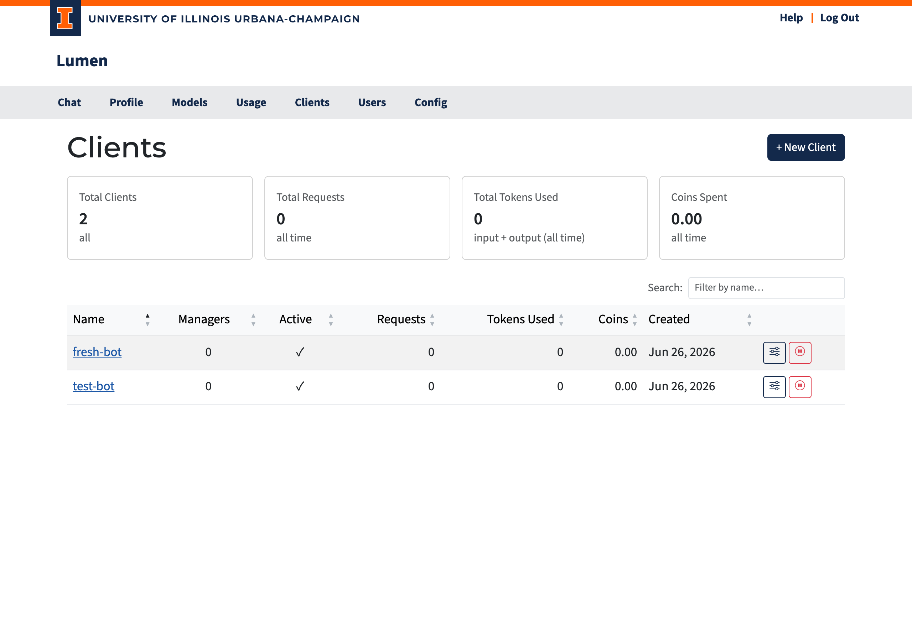

# Projects

> **Advanced feature:** The Projects section is for people building services or automated tools that use Lumen. Regular users won't need this page.

The **Projects** page (`/projects`) is where you manage application projects — named identities for services or automated processes that need their own API access.

## What Is a Project?

A **project** is a named entity separate from your personal user account. It has its own API keys, coin pool, and usage counters. Projects are useful when you need to:

- Build an application or service that calls AI models on behalf of users
- Run automated pipelines or scripts that need stable, long-lived credentials
- Separate application usage from your personal usage and budget
- Allow a team to share access to a set of credentials without sharing anyone's personal key

Think of a project as a shared identity for automated tools: it has a name (e.g., `research-bot`, `data-pipeline`), it accumulates its own usage history, and its API keys are managed independently.

## Who Can See What

| Role | Visibility |
|------|-----------|
| **Admin** | All projects in the system |
| **Manager** | Only projects they are assigned to manage |

If you are a manager of one or more projects, you will see them listed here. If you don't see the Projects page at all, your account has not been assigned as a manager of any project.

## Summary Cards

At the top of the page, four cards summarize the projects you can see:

| Card | Description |
|------|-------------|
| **Total Projects** | Number of projects visible to you |
| **Total Requests** | Combined API requests across all visible projects |
| **Total Tokens Used** | Combined input + output tokens |
| **Coins Spent** | Combined coin cost |

## Project Table

| Column | Description |
|--------|------------|
| **Name** | Clickable link to the project detail page |
| **Managers** | Number of users who manage this project |
| **Active** | Green checkmark for active, red X for deactivated |
| **Requests** | Total API requests |
| **Tokens Used** | Total input + output tokens |
| **Coins** | Total coins spent |
| **Created** | When the project was created |

Click any column header to sort. Use the search box to filter by name.

## Creating a Project

> **Admin setup:** Projects are created through the web interface here, but coin budgets and model access defaults are configured in `config.yaml`. See [Configuring Projects](../admin/config-projects.md) for details.

Only administrators can create new projects:

1. Click **+ New Project**.
2. Enter a name (e.g., `my-service-app`).
3. Click **Create**.

You will be redirected to the new project's detail page where you can set up managers and API keys.
